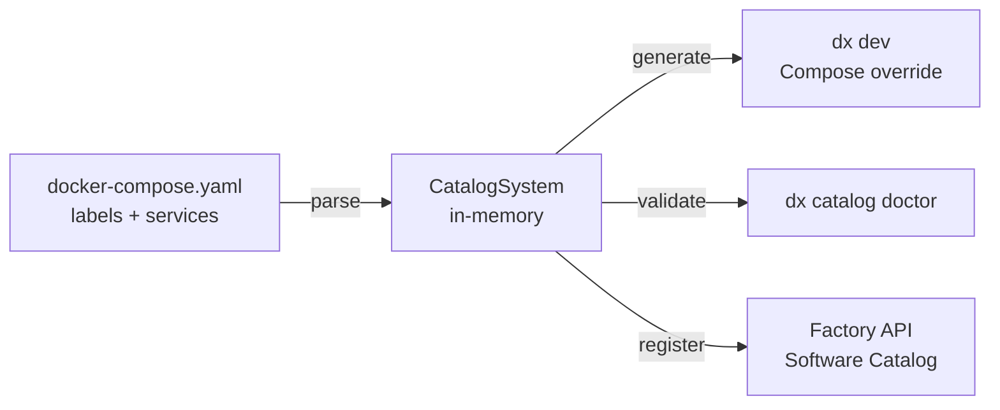
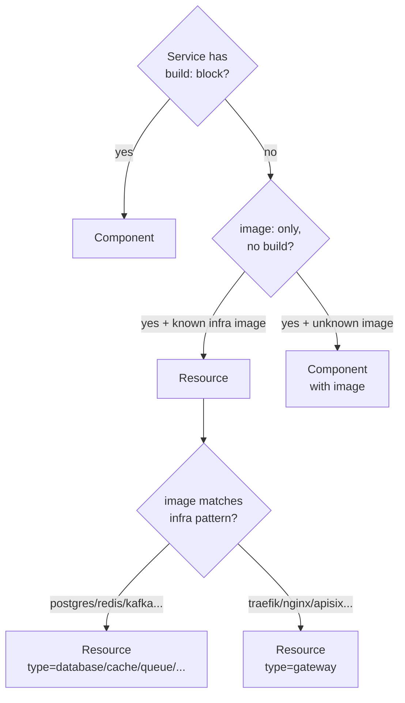

# Catalog System

The Factory software catalog is derived automatically from `docker-compose.yaml`. There is no separate `catalog.yaml`, `dx.yaml`, or registry to maintain — the compose file is the single source of truth for both runtime and catalog data.

## Core Idea



The `docker-compose.adapter.ts` in `shared/` reads a compose file and produces a `CatalogSystem` object — a Backstage-aligned in-memory model of all systems, components, resources, and APIs in the project. Every other tool (CLI, API, UI) operates on this model.

## Label Namespaces

Two label namespaces are recognised:

| Namespace   | Purpose                                                         |
| ----------- | --------------------------------------------------------------- |
| `catalog.*` | Entity metadata: kind, owner, lifecycle, API declarations       |
| `dx.*`      | Dev tooling hints: port names, healthcheck paths, env expansion |

### catalog.\* labels

```yaml
services:
  api:
    labels:
      catalog.type: component # Component | Resource | System | API
      catalog.owner: team-platform # slug of owning team
      catalog.description: "REST API for the factory control plane"
      catalog.tags: "api,backend,core"
      catalog.lifecycle: production # experimental | development | production | deprecated
      catalog.api.provides: "factory-api" # API entity this service exposes
      catalog.api.consumes: "auth-api" # API entities this service depends on
```

### dx.\* labels

```yaml
services:
  api:
    labels:
      dx.port.http: "3001" # Named port — sets PORT_HTTP env var
      dx.healthcheck: "/health" # HTTP path used for dx status checks
      dx.env.DATABASE_URL: "${DATABASE_URL:-postgresql://...}" # Explicit env expansion
```

## Classification Rules

When `catalog.type` is absent the adapter infers entity kind from structural signals:



**Components** are services your team owns and builds. **Resources** are infrastructure you consume (databases, caches, queues). This mirrors the Backstage vocabulary.

### Well-known infrastructure images

The adapter contains an exhaustive pattern table for common images:

| Image pattern                                            | Resource type |
| -------------------------------------------------------- | ------------- |
| `postgres`, `postgis`, `timescaledb`, `mysql`, `mongo`   | `database`    |
| `redis`, `valkey`, `memcached`                           | `cache`       |
| `rabbitmq`, `nats`, `kafka`                              | `queue`       |
| `minio`, `localstack`                                    | `storage`     |
| `elasticsearch`, `opensearch`, `meilisearch`             | `search`      |
| `traefik`, `nginx`, `envoy`, `haproxy`, `apisix`, `kong` | `gateway`     |

Explicit `catalog.type` labels always take precedence over heuristics.

## The CatalogSystem Type

```ts
// shared/src/catalog.ts
export type CatalogSystem = {
  name: string
  namespace: string
  description?: string
  components: CatalogComponent[]
  resources: CatalogResource[]
  connections: CatalogConnection[]
}
```

Each component carries its ports, healthchecks, compute hints, route declarations, and dependency graph edges:

```ts
export type CatalogComponent = {
  name: string
  kind: "Component"
  lifecycle: CatalogLifecycle     // "experimental" | "development" | "production" | "deprecated"
  owner?: string
  description?: string
  tags?: string[]
  ports: CatalogPort[]
  healthchecks: { live?: ..., ready?: ..., start?: ... }
  routes?: CatalogRoute[]
  compute?: { min?: { cpu, memory }, max?: { cpu, memory } }
  environment?: Record<string, string>
  // ...
}
```

## Port Resolution

Named ports (`dx.port.<name>: "<number>"`) are promoted to `CatalogPort` entries. If no named ports are declared, the adapter infers names from the well-known port table:

```ts
const KNOWN_PORTS: Record<number, { name: string; protocol: string }> = {
  5432: { name: "postgres", protocol: "tcp" },
  6379: { name: "redis", protocol: "tcp" },
  8080: { name: "http", protocol: "http" },
  4317: { name: "otlp-grpc", protocol: "grpc" },
  // ...
}
```

Port names flow through to `dx dev` (which sets `PORT_<NAME>` environment variables) and to Kubernetes service definitions generated from the catalog.

## Lifecycle Enum

```ts
// shared/src/catalog.ts
export const catalogLifecycleSchema = z.enum([
  "experimental",
  "development",
  "production",
  "deprecated",
])
```

Lifecycle controls visibility in `dx catalog` output and gates certain operations (e.g. `deprecated` components emit warnings during `dx up`).

## Backstage Alignment

The catalog vocabulary is intentionally aligned with [Backstage](https://backstage.io/docs/features/software-catalog/):

| Backstage | Factory                              | Notes                   |
| --------- | ------------------------------------ | ----------------------- |
| System    | `CatalogSystem`                      | Top-level grouping      |
| Component | `CatalogComponent`                   | Owned, built service    |
| Resource  | `CatalogResource`                    | Consumed infrastructure |
| API       | `CatalogPort` + `api.provides` label | Protocol endpoint       |
| Group     | `catalog.owner` label                | Owning team slug        |

This alignment means catalog data can be exported to Backstage or consumed by Backstage plugins without transformation.

## Format Adapters

The catalog is a runtime model — adapters convert it to/from file formats:

| Adapter                       | Direction        | Output                                 |
| ----------------------------- | ---------------- | -------------------------------------- |
| `docker-compose.adapter.ts`   | parse → generate | Reads compose, writes compose override |
| `helm` adapter (planned)      | generate         | Helm `values.yaml`                     |
| `backstage` adapter (planned) | generate         | `catalog-info.yaml`                    |

All adapters live in `shared/src/formats/` and implement the `CatalogFormatAdapter` interface.

## dx catalog doctor

`dx catalog doctor` runs the adapter in validation mode and reports:

- Services missing `catalog.owner`
- Components without healthchecks
- `catalog.api.consumes` references that don't resolve to a known `catalog.api.provides`
- Ports that conflict with well-known port assignments

It exits non-zero on errors, making it suitable for CI pre-flight checks.

## Connection Graph

The `connections` array in `CatalogSystem` captures dependency edges derived from:

1. `catalog.api.consumes` labels (explicit)
2. `depends_on` keys in the compose file (structural)
3. Environment variable references to other service names (heuristic)

This graph is used by `dx dev` to determine which services need to be stopped or forwarded when switching to a remote connection profile.

## See Also

- [Schema Design](/architecture/schemas) — how catalog types map to DB entities
- [Connection Contexts](/architecture/connection-contexts) — how catalog ports become tunnel targets
- [Deployment Model](/architecture/deployment-model) — how catalog components become ComponentDeployments
