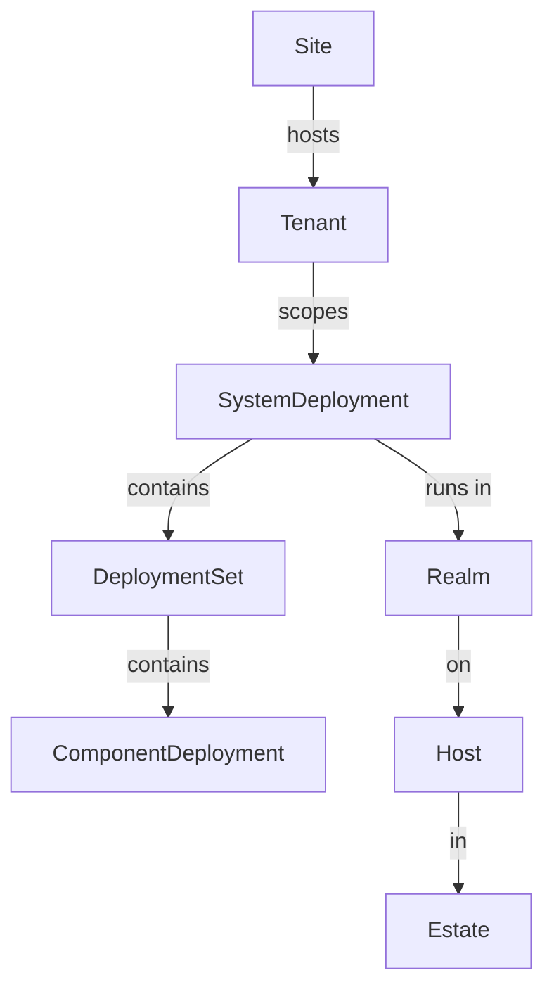
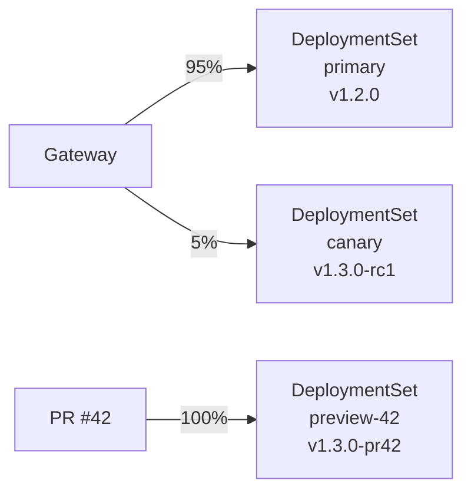
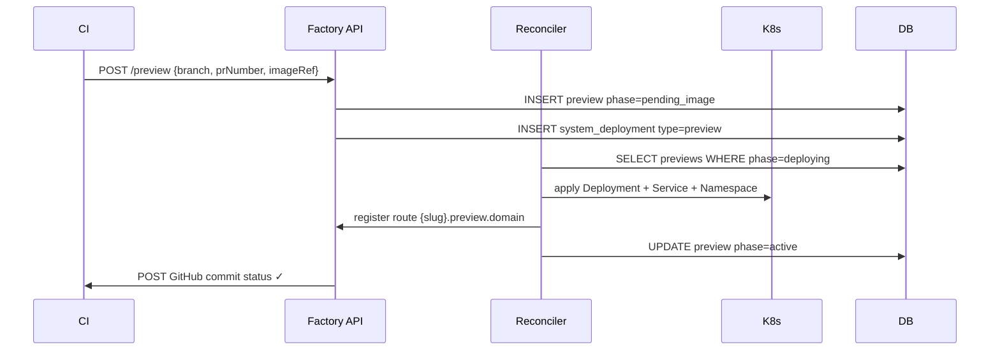
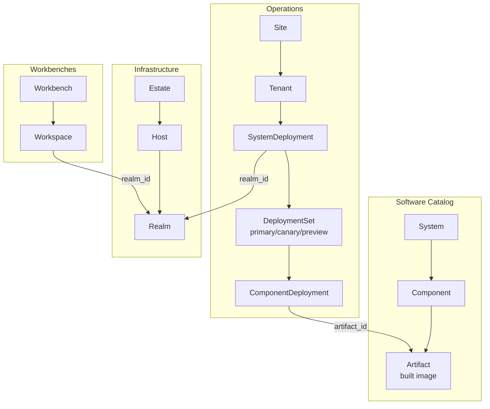

# Deployment Model

The Factory deployment model defines a layered hierarchy from physical infrastructure up to individual running containers. Understanding this hierarchy is essential for reasoning about where workloads run, how they are isolated, and how traffic reaches them.

## The Hierarchy



Each layer maps directly to a database table in the `ops` schema (see [Schema Design](/architecture/schemas)).

## Estate and Host

**Estate** is the ownership hierarchy for physical or cloud infrastructure: accounts, regions, datacenters, VPCs, subnets, racks. Estates nest — a VPC is an estate inside a region estate inside an account estate.

**Host** is a physical or virtual machine. Every host belongs to an estate and carries a `HostSpec` (JSONB) with fields like `ipAddress`, `os`, `arch`, and Proxmox-specific metadata.

```ts
// infra schema
estate → host (estate_id FK)
```

Hosts are discovered either by manual registration (`dx cluster register`) or by the Proxmox sync loop that polls the hypervisor for VMs.

## Realm

A **Realm** is an active execution environment — a bounded domain where workloads are spawned and controlled. It is the "runtime" in reconciler terms.

```ts
// infra schema
export const realm = infraSchema.table("realm", {
  type: text("type").notNull(), // "kubernetes" | "compose" | "systemd" | ...
  parentRealmId: text("parent_realm_id"), // nested realms (e.g. namespace inside cluster)
  estateId: text("estate_id"),
  workbenchId: text("workbench_id"), // optional: associated local workbench
  spec: specCol<RealmSpec>(),
  ...reconciliationCols(),
})
```

A realm's `type` selects the [runtime strategy](/architecture/reconciler#runtime-strategies) the reconciler uses. A Kubernetes cluster is one realm; the local Docker Compose environment on a developer's workbench is another.

Realms can span multiple hosts via the `realm_host` join table (e.g. a three-node k3s cluster).

## Site

A **Site** is a named deployment environment with a lifecycle and a type:

```ts
// ops schema
export const site = opsSchema.table("site", {
  slug: text("slug").notNull(),
  name: text("name").notNull(),
  spec: specCol<SiteSpec>(),
  ...bitemporalCols(),
})
```

`SiteSpec` (in `shared/src/schemas/ops.ts`) captures:

| Field       | Values                                    | Meaning                        |
| ----------- | ----------------------------------------- | ------------------------------ |
| `type`      | `cloud`, `on-prem`, `edge`, `hybrid`      | Where the infrastructure lives |
| `lifecycle` | `production`, `staging`, `dev`, `preview` | How it is used                 |
| `access`    | `public`, `private`, `air-gapped`         | Network reachability           |
| `region`    | string                                    | Geographic region identifier   |

Sites use [bitemporal columns](/architecture/schemas#bitemporal-columns) so the full history of site configuration is preserved.

### Site types

| Type      | Description                                    |
| --------- | ---------------------------------------------- |
| `cloud`   | Hosted on a cloud provider (AWS, GCP, Azure)   |
| `on-prem` | Bare-metal or private datacenter               |
| `edge`    | Low-latency edge node (CDN PoP, branch office) |
| `hybrid`  | Mixed — some cloud, some on-prem               |

## Tenant

A **Tenant** scopes deployment within a site to a specific customer or team. It links a `Site` to a `Customer` (from the commerce schema):

```ts
export const tenant = opsSchema.table("tenant", {
  siteId: text("site_id").references(() => site.id),
  customerId: text("customer_id").notNull(), // cross-schema FK to commerce.customer
  spec: specCol<TenantSpec>(),
  ...bitemporalCols(),
  ...reconciliationCols(),
})
```

`TenantSpec` carries the isolation mode:

| Mode        | Description                                                        |
| ----------- | ------------------------------------------------------------------ |
| `shared`    | Multiple tenants share the same underlying infrastructure pool     |
| `dedicated` | Tenant gets its own node pool or VM group; still on shared cluster |
| `isolated`  | Tenant has its own Realm (separate Kubernetes cluster or VM group) |

## SystemDeployment

A **SystemDeployment** is an instance of a `System` (from the software catalog) running at a specific `Site` for a specific `Tenant`:

```ts
export const systemDeployment = opsSchema.table("system_deployment", {
  type: text("type").notNull(), // "production" | "staging" | "dev"
  systemId: text("system_id").references(() => system.id),
  siteId: text("site_id").references(() => site.id),
  tenantId: text("tenant_id").references(() => tenant.id),
  realmId: text("realm_id").references(() => realm.id), // where it runs
  spec: specCol<SystemDeploymentSpec>(),
  ...bitemporalCols(),
  ...reconciliationCols(),
})
```

One `System` can have many `SystemDeployment`s — production at a customer site, staging for QA, a preview for a PR, a dev instance on a workbench.

## DeploymentSet

A **DeploymentSet** groups `ComponentDeployment`s within a `SystemDeployment` by traffic tier:

```ts
export const deploymentSet = opsSchema.table("deployment_set", {
  systemDeploymentId: text("system_deployment_id"),
  realmId: text("realm_id"),
  spec: specCol<DeploymentSetSpec>(),
  ...reconciliationCols(),
})
```

Traffic tiers allow multiple versions to run simultaneously:

| Tier      | Description                                     |
| --------- | ----------------------------------------------- |
| `primary` | Main production traffic (100% by default)       |
| `canary`  | Small traffic slice to validate a new version   |
| `preview` | Isolated PR environment — no production traffic |

`DeploymentSetSpec` carries the traffic weight (e.g. `{ primary: 95, canary: 5 }`) and the routing rules for how requests are split.



## ComponentDeployment

A **ComponentDeployment** is the leaf node — one `Component` running at a specific image version inside a `DeploymentSet`:

```ts
export const componentDeployment = opsSchema.table("component_deployment", {
  systemDeploymentId: text("system_deployment_id"),
  deploymentSetId: text("deployment_set_id"),
  componentId: text("component_id").references(() => component.id),
  artifactId: text("artifact_id").references(() => artifact.id),
  spec: specCol<ComponentDeploymentSpec>(),
  ...reconciliationCols(),
})
```

`ComponentDeploymentSpec` includes:

- Desired image / artifact URI
- Replica count
- Environment overrides
- Resource limits

The [Reconciler](/architecture/reconciler) drives every active `ComponentDeployment` toward its desired state.

## Workspace

A **Workspace** is a cloud development environment — a persistent container (or set of containers) assigned to a developer, agent, or CI job:

```ts
export const workspace = opsSchema.table("workspace", {
  type: text("type").notNull(), // "developer" | "agent" | "ci" | "playground"
  hostId: text("host_id"), // physical host it runs on
  realmId: text("realm_id"), // execution environment
  ownerId: text("owner_id"), // principal who owns it
  templateId: text("template_id"), // template it was created from
  spec: specCol<WorkspaceSpec>(),
  ...bitemporalCols(),
  ...reconciliationCols(),
})
```

Workspaces use bitemporal columns so branching (forking a workspace from a snapshot) and merging can be tracked over time.

## Preview Environments

Preview environments are ephemeral `SystemDeployment`s created automatically for each pull request:



Preview environments live at `{slug}.preview.<domain>` and are automatically expired when:

- The PR is closed or merged.
- A configurable TTL elapses.
- The deployment is manually stopped.

The reconciler's cleanup pass deletes the Kubernetes namespace for `expired` previews, and the `SystemDeployment` `spec.status` is set to `destroyed`.

## Air-Gapped Deployments

For sites with `access: "air-gapped"`, `dx` can produce a **release bundle** — a self-contained archive that includes:

- All container images (exported as OCI tarballs).
- The `docker-compose.yaml` and compose overrides.
- Migration SQL files.
- A `dx up` bootstrap script.

The bundle is transferred to the air-gapped site by physical media or a bastion host. The bootstrap script imports images into the local registry and runs `dx up` from the bundle, with no outbound internet access required.

## Full Picture



## See Also

- [Schema Design](/architecture/schemas) — bitemporal and reconciliation columns
- [Reconciler](/architecture/reconciler) — how ComponentDeployments and Workspaces converge
- [Catalog System](/architecture/catalog-system) — how Components and Systems are defined
- [Connection Contexts](/architecture/connection-contexts) — how developers connect to any tier
