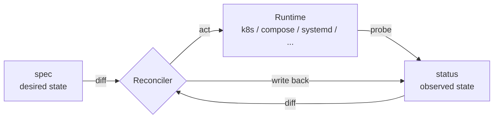
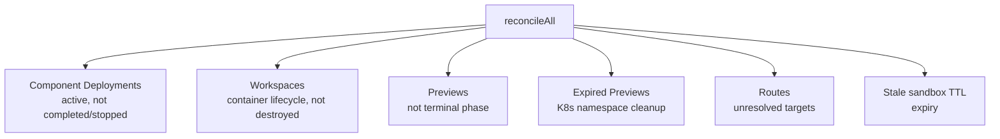
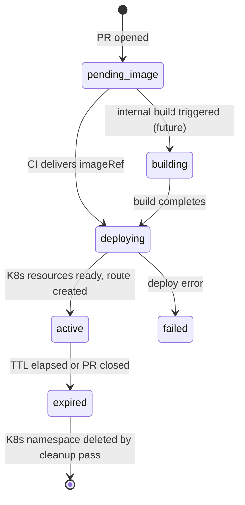

# Reconciler

The Factory reconciler is a Kubernetes-style control loop. It continuously compares **desired state** (the `spec` JSONB in the database) against **observed state** (what is actually running on the target runtime) and takes corrective action until they converge.

## Core Model



Three database columns drive this loop on every reconcilable entity:

| Column               | Type     | Role                                          |
| -------------------- | -------- | --------------------------------------------- |
| `generation`         | `bigint` | Incremented whenever `spec` changes           |
| `observedGeneration` | `bigint` | Last generation the reconciler acted on       |
| `status`             | `jsonb`  | Observed state written back by the reconciler |

The reconciler selects entities where `generation != observedGeneration` — everything else is already converged and skipped.

## What Gets Reconciled

`Reconciler.reconcileAll()` processes four categories per tick:



Each category is iterated independently; errors in one entity do not block others.

## Runtime Strategies

The reconciler is **runtime-agnostic**. Each Realm (execution environment) declares its `type`, and a matching strategy is selected at runtime:

```ts
// Registered in Reconciler constructor
registerRealmStrategy("kubernetes", () => new KubernetesStrategy(kube))
registerRealmStrategy("compose", () => new ComposeStrategy())
registerRealmStrategy("systemd", () => new SystemdStrategy())
registerRealmStrategy("windows_service", () => new WindowsServiceStrategy())
registerRealmStrategy("iis", () => new IisStrategy())
registerRealmStrategy("process", () => new NoopStrategy())
```

All strategies implement the `RealmStrategy` interface:

```ts
export interface RealmStrategy {
  readonly runtime: string
  reconcile(ctx: ReconcileContext, db: Database): Promise<ReconcileResult>
}
```

`ReconcileContext` carries everything a strategy needs — the desired workload spec, component shape, and deployment target — without the strategy needing to query the database itself.

### Strategy Responsibilities

| Strategy                 | Runtime        | What it does                                                       |
| ------------------------ | -------------- | ------------------------------------------------------------------ |
| `KubernetesStrategy`     | Kubernetes     | Apply Deployment, Service, PVC manifests via `kubectl` or kube API |
| `ComposeStrategy`        | Docker Compose | Generate compose override, call `docker compose up -d`             |
| `SystemdStrategy`        | Linux systemd  | Write unit file, call `systemctl enable --now`                     |
| `WindowsServiceStrategy` | Windows        | Manage Windows services via `sc` commands                          |
| `IisStrategy`            | IIS            | Configure IIS application pools and sites                          |
| `NoopStrategy`           | Process / bare | Record state only — no provisioning actions                        |

## ReconcileContext

```ts
export interface ReconcileContext {
  workload: {
    workloadId: string
    desiredImage: string
    desiredArtifactUri?: string | null
    replicas: number
    envOverrides: Record<string, unknown>
    resourceOverrides: Record<string, unknown>
    moduleVersionId: string
  }
  component: {
    name: string
    kind: string
    ports: Array<{ name: string; port: number; protocol: string }>
    healthcheck?: { path: string; portName: string; protocol: string } | null
    isPublic: boolean
    stateful: boolean
    defaultCpu: string
    defaultMemory: string
    defaultReplicas: number
  }
  target: {
    systemDeploymentId: string
    name: string
    kind: string
    runtime: string
    clusterId?: string | null
    hostId?: string | null
    namespace?: string | null
  }
  moduleName: string
}
```

## ReconcileResult

```ts
export interface ReconcileResult {
  status: "running" | "completed" | "failed"
  actualImage?: string | null
  driftDetected: boolean
  details?: Record<string, unknown>
}
```

`driftDetected: true` means the reconciler found the runtime state diverging from spec (e.g. a different image running than desired). This is recorded in `status` and can trigger alerts or re-deployments.

## Component Deployment Loop

```mermaid
sequenceDiagram
    participant Loop as reconcileAll()
    participant DB
    participant Strategy

    Loop->>DB: SELECT component_deployment WHERE status != completed/stopped
    loop each active deployment
        Loop->>DB: SELECT spec, component, target details
        Loop->>Strategy: reconcile(ctx)
        Strategy-->>Loop: ReconcileResult
        Loop->>DB: UPDATE status, observedGeneration = generation
    end
```

## Workspace (Sandbox) Reconciliation

Workspaces are cloud development environments backed by Kubernetes. The reconciler:

1. Selects workspaces where `systemTo IS NULL AND validTo IS NULL` (current, non-deleted, per bitemporal schema).
2. Filters to `spec.realmType === "container"` and `spec.lifecycle !== "destroyed"`.
3. For each: generates Kubernetes PVC, Pod, and Service manifests from the workspace spec, then applies them.

The sandbox resource generator (`sandbox-resource-generator.ts`) handles:

- PVC provisioning from snapshots (`generatePVCFromSnapshot`)
- Full sandbox manifest set (`generateSandboxResources`)
- Volume snapshot creation for workspace branching (`generateVolumeSnapshots`)

## Preview Reconciler

Previews (PR environments) are managed by `PreviewReconciler`, a specialized state machine:



| Phase           | Description                                                         |
| --------------- | ------------------------------------------------------------------- |
| `pending_image` | Waiting for CI to call the Factory API with a built image reference |
| `building`      | Future: internal Envbuilder sandbox compiles the image              |
| `deploying`     | Creates K8s Deployment + Service, registers route in gateway        |
| `active`        | Serving at `{slug}.preview.<domain>`                                |
| `inactive`      | Deployment scaled to zero (saves resources)                         |
| `expired`       | TTL exceeded; pending namespace cleanup                             |
| `failed`        | Build or deploy error; PR check set to failure                      |

The main `Reconciler` runs `PreviewReconciler.reconcilePreview()` for each preview not in a terminal state (`active`, `inactive`, `expired`, `failed`). A separate pass in `reconcileAll()` cleans up Kubernetes namespaces for expired previews.

## Route Reconciliation

After workload and workspace reconciliation, the loop calls `reconcileRoutes()`, which:

1. Finds routes with unresolved targets (the target host or IP is not yet known).
2. Calls `resolveRouteTargets()` to look up the current IP from the infra model.
3. Updates the route `spec` and triggers a Traefik sync if needed.

## Error Handling

Each entity is reconciled inside an independent `try/catch`. A failure is logged with structured context (`{ componentDeploymentId, err }`) and counted. The loop continues with the next entity.

```ts
for (const cd of activeDeployments) {
  try {
    await this.reconcileWorkload(cd.id)
    reconciled++
  } catch (err) {
    errors++
    logger.error({ componentDeploymentId: cd.id, err }, "Failed to reconcile")
  }
}
```

`reconcileAll()` returns `{ reconciled, errors }` — the caller (a scheduled job or HTTP trigger) can surface this as a health metric.

## Retry Strategy

The reconciler does not implement internal retry — it relies on the **next loop tick** for retries. Since `observedGeneration` is only updated on success, a failed reconciliation leaves `generation != observedGeneration`, so the entity is selected again on the next run.

This is the same model Kubernetes controllers use: continuous level-triggered reconciliation rather than edge-triggered retries.

## Stale Sandbox Expiry

At the end of each `reconcileAll()` tick, `expireStale(db)` is called from `workspace.service.ts`. It finds workspaces past their TTL (stored in `spec.ttl`) and transitions them to `lifecycle: "expired"`, which stops the reconciler from provisioning them further.

## See Also

- [Schema Design](/architecture/schemas) — `generation`, `observedGeneration`, `status` columns
- [Deployment Model](/architecture/deployment-model) — how SystemDeployments and ComponentDeployments are structured
- [Connection Contexts](/architecture/connection-contexts) — how agents and users connect to reconciled workloads
