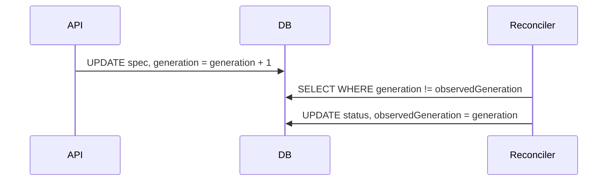
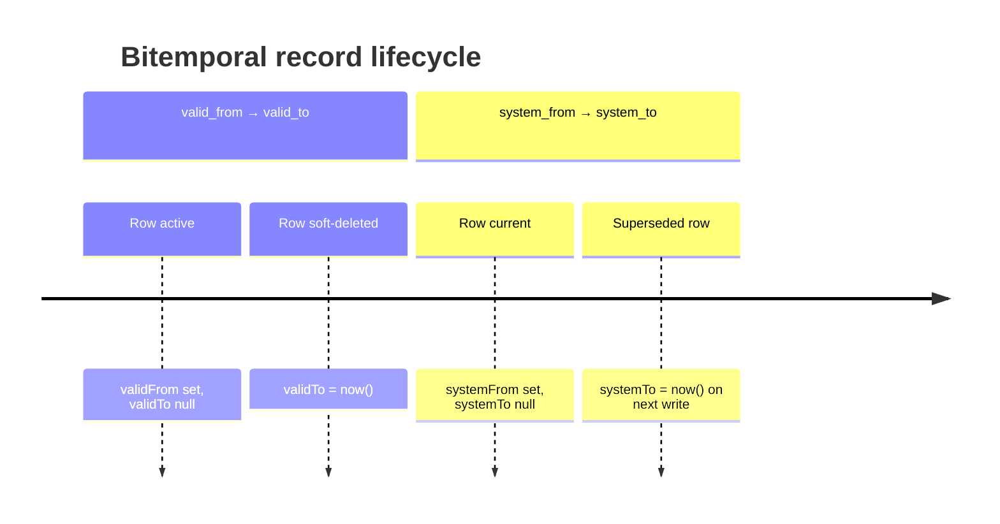

# Schema Design

Factory uses a **Zod-first, JSONB-heavy** schema strategy. Entity definitions begin as Zod schemas in TypeScript, database tables are derived from them with Drizzle ORM, and runtime types flow from `z.infer<>`. No SQL is written by hand for schema changes.

## Guiding Principles

| Principle                      | Implication                                                                                     |
| ------------------------------ | ----------------------------------------------------------------------------------------------- |
| **Zod-first**                  | Every entity's shape is defined in `shared/src/schemas/*.ts` before a DB table exists           |
| **JSONB-first**                | Foreign keys and type discriminators are columns; everything else is `spec` or `metadata` JSONB |
| **Plain text types**           | All discriminator columns are `text` in Postgres, validated by Zod enums at the app layer       |
| **Slug references**            | Entities reference each other by human-readable slug, not opaque UUID                           |
| **No hand-written migrations** | Always use `pnpm db:generate` in `api/`; never write migration SQL directly                     |

## Schema Namespaces

The database is divided into six Postgres schemas, each with a matching Drizzle schema object defined in `api/src/db/schema/helpers.ts`:

```ts
export const softwareSchema = pgSchema("software")
export const orgSchema = pgSchema("org")
export const infraSchema = pgSchema("infra")
export const opsSchema = pgSchema("ops")
export const buildSchema = pgSchema("build")
export const commerceSchema = pgSchema("commerce")
```

Tables are defined inside their schema namespace, e.g. `infraSchema.table("host", ...)`. This keeps concerns cleanly separated and avoids name collisions across domains.

## Anatomy of an Entity Table

Every entity table follows the same column pattern:

```ts
// api/src/db/schema/infra.ts (simplified)
export const host = infraSchema.table("host", {
  id: text("id")
    .primaryKey()
    .$defaultFn(() => newId("host")),
  slug: text("slug").notNull(),
  name: text("name").notNull(),
  type: text("type").notNull(), // plain text — Zod validates
  estateId: text("estate_id").references(() => estate.id), // FK as column

  spec: specCol<HostSpec>(), // JSONB — all domain fields
  metadata: metadataCol(), // JSONB — labels/annotations/tags

  createdAt: createdAt(),
  updatedAt: updatedAt(),
  ...reconciliationCols(),
})
```

### Column helpers (from `helpers.ts`)

```ts
// JSONB spec — typed at compile time, SQL default `'{}'`
export const specCol = <T>() =>
  jsonb("spec")
    .$type<T>()
    .notNull()
    .default(sql`'{}'`)

// JSONB metadata — standardised labels/annotations/tags/links
export const metadataCol = () =>
  jsonb("metadata")
    .$type<EntityMetadata>()
    .notNull()
    .default(sql`'{}'`)
```

The `specCol<T>()` call binds a TypeScript interface at compile time. The actual DB column is just `jsonb` — the type annotation is erased at runtime. Zod validates shape when data enters the system; the DB trusts the app layer.

### ID generation

IDs are prefixed strings rather than raw UUIDs:

```ts
newId("host") // → "host_01HX..."
newId("est") // → "est_01HX..."
newId("wks") // → "wks_01HX..."
```

The prefix makes log messages and foreign key errors immediately human-readable.

## The JSONB spec/metadata split

**`spec`** holds the authoritative desired-state or configuration for an entity — whatever the reconciler or application logic needs to operate on. It is typed per-entity.

**`metadata`** holds cross-cutting observability data: labels, annotations, tags, and links. Its type (`EntityMetadata`) is shared across all entities and maps to Backstage catalog metadata conventions.

This split means you can add new fields to an entity's `spec` Zod schema without a migration. The JSONB column absorbs new keys transparently.

## Plain Text Type Columns

Instead of Postgres enums (which require `ALTER TYPE` to extend), Factory uses `text` columns for all discriminators:

```ts
type: text("type").notNull() // "developer" | "agent" | "ci" | "playground"
```

Zod enforces the allowed values at the application boundary:

```ts
// shared/src/schemas/ops.ts
export const workspaceTypeSchema = z.enum([
  "developer",
  "agent",
  "ci",
  "playground",
])
```

Adding a new workspace type requires only a Zod schema change — no migration.

## Reconciliation Columns

Entities with external state (deployments, workspaces, previews) carry reconciliation columns defined in `helpers.ts`:

```ts
export const reconciliationCols = () => ({
  status: jsonb("status")
    .$type<Record<string, unknown>>()
    .notNull()
    .default(sql`'{}'`),
  generation: bigint("generation", { mode: "number" }).notNull().default(0),
  observedGeneration: bigint("observed_generation", { mode: "number" })
    .notNull()
    .default(0),
})
```

- **`generation`** — incremented whenever `spec` changes (desired state).
- **`observedGeneration`** — the last generation the reconciler successfully acted on.
- **`status`** — freeform JSONB written back by the reconciler with observed state (image, phase, error message, etc.).

A reconciler loop can cheaply detect work to do: `generation != observedGeneration`.



See [Reconciler](/architecture/reconciler) for the full loop.

## Bitemporal Columns

Some entities (Site, Tenant, SystemDeployment, Workspace) use bitemporal tracking, which records both when something was true in the real world (valid time) and when it was recorded in the database (system time):

```ts
export const bitemporalCols = () => ({
  validFrom: timestamp("valid_from", { withTimezone: true })
    .defaultNow()
    .notNull(),
  validTo: timestamp("valid_to", { withTimezone: true }), // null = current
  systemFrom: timestamp("system_from", { withTimezone: true })
    .defaultNow()
    .notNull(),
  systemTo: timestamp("system_to", { withTimezone: true }), // null = latest
  changedBy: text("changed_by").notNull().default("system"),
  changeReason: text("change_reason"),
})
```

| Column                    | Meaning                                               |
| ------------------------- | ----------------------------------------------------- |
| `validFrom` / `validTo`   | When this fact was true in the business domain        |
| `systemFrom` / `systemTo` | When this row was the current record in the DB        |
| `changedBy`               | Principal (user slug or "system") who made the change |
| `changeReason`            | Optional audit note                                   |

**Queries for current records** filter `systemTo IS NULL AND validTo IS NULL`. Soft-deletes set `systemTo = now()` rather than `DELETE`. This gives a full audit log at zero extra cost.



The Reconciler filters bitemporal tables explicitly:

```ts
// Only reconcile current (non-deleted) workspaces
.where(and(isNull(workspace.systemTo), isNull(workspace.validTo)))
```

## Drizzle ORM Integration

Schema files (`api/src/db/schema/*.ts`) export Drizzle table objects directly. Queries are written with Drizzle's query builder — no raw SQL except in custom migration files.

Migrations are generated by diffing the current schema against the last snapshot:

```sh
cd api && pnpm db:generate   # emits api/drizzle/NNNN_*.sql
```

The journal at `api/drizzle/meta/_journal.json` tracks applied migrations. Never edit it manually.

Cross-schema foreign keys that Drizzle cannot infer (e.g. `realm.workbenchId` → `ops.workbench`) are left as bare `text` columns in the schema and the referential constraint is enforced at the application layer rather than in the DB.

## Where to Find Things

| Concern                                                             | File                            |
| ------------------------------------------------------------------- | ------------------------------- |
| Column helper builders                                              | `api/src/db/schema/helpers.ts`  |
| Infrastructure entities (Estate, Host, Realm, Service, Route…)      | `api/src/db/schema/infra.ts`    |
| Operations entities (Site, Tenant, Workspace, Preview, Deployment…) | `api/src/db/schema/ops.ts`      |
| Software entities (System, Component, Release, Artifact…)           | `api/src/db/schema/software.ts` |
| Organisation entities (Principal, Group…)                           | `api/src/db/schema/org.ts`      |
| Zod spec types for infra                                            | `shared/src/schemas/infra.ts`   |
| Zod spec types for ops                                              | `shared/src/schemas/ops.ts`     |

## See Also

- [Catalog System](/architecture/catalog-system) — how Zod entity types surface in the software catalog
- [Reconciler](/architecture/reconciler) — how `generation`/`observedGeneration` drives convergence
- [Deployment Model](/architecture/deployment-model) — the Site → Tenant → SystemDeployment hierarchy
