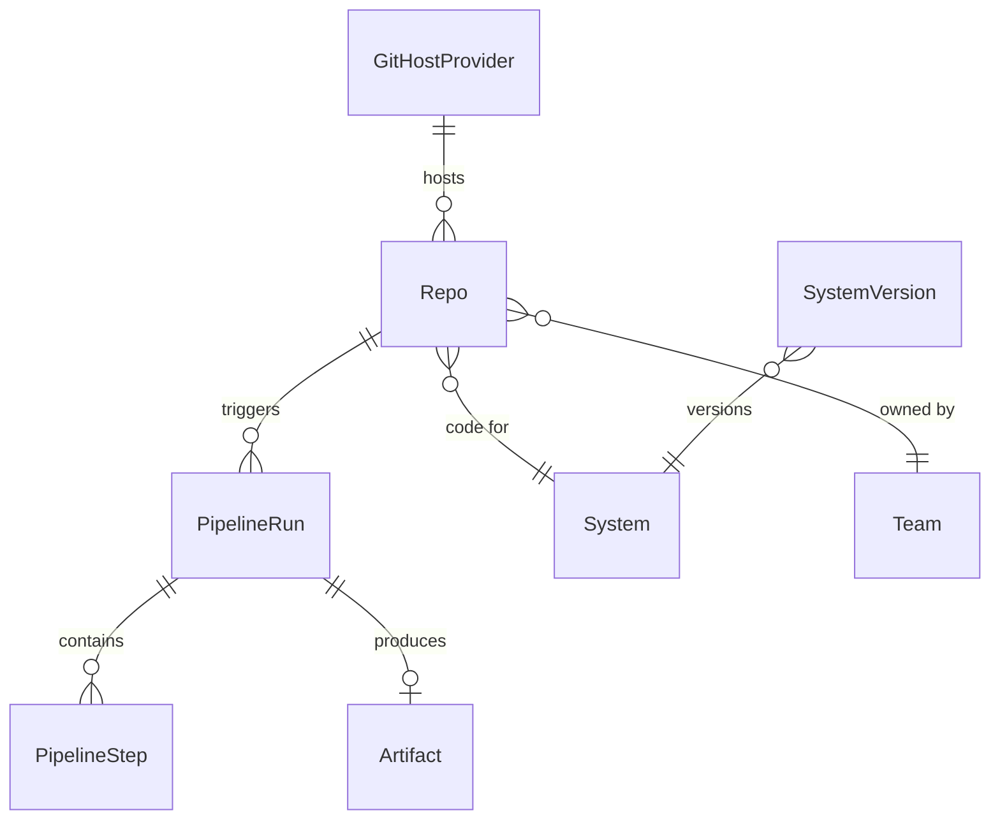
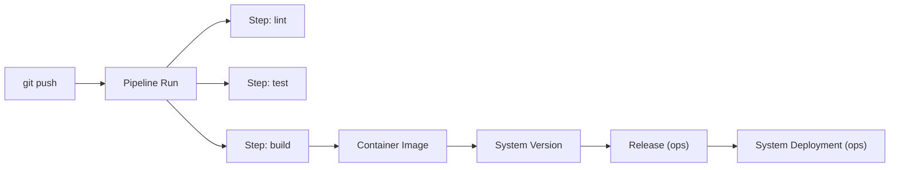

# build — How It Ships

> Source control, CI/CD pipelines, and the path from code to production.

## Overview

The `build` domain tracks the journey from source code to deployable artifact. A **Repo** contains the code, connected to an external **Git Host Provider** (GitHub, GitLab, etc.). **Pipeline Runs** execute CI/CD jobs that produce **Artifacts**. **System Versions** tag reproducible snapshots ready for deployment.

## Entity Map



## Entities

### Repo

Git repository — the source of code.

| Field             | Type    | Description                |
| ----------------- | ------- | -------------------------- |
| id                | string  | Unique identifier          |
| slug              | string  | URL-safe identifier        |
| name              | string  | Display name               |
| kind              | enum    | See kinds below            |
| systemId          | string? | Links to software.system   |
| teamId            | string? | Owning team                |
| gitHostProviderId | string  | Git hosting service        |
| gitUrl            | string  | Clone URL                  |
| defaultBranch     | string  | Main branch (e.g., `main`) |

**Kinds:** `product-module`, `platform-module`, `library`, `vendor-module`, `client-project`, `infra`, `docs`, `tool`

**Example:**

```json
{
  "slug": "auth-platform",
  "name": "Auth Platform",
  "kind": "product-module",
  "systemId": "sys_auth",
  "gitUrl": "git@github.com:factory/auth-platform.git",
  "defaultBranch": "main"
}
```

### Git Host Provider

Integration with an external Git hosting service.

| Field      | Type   | Description                              |
| ---------- | ------ | ---------------------------------------- |
| slug       | string | Provider identifier                      |
| hostType   | enum   | `github`, `gitlab`, `gitea`, `bitbucket` |
| authMode   | enum   | `token`, `app`, `oauth`                  |
| apiBaseUrl | string | API endpoint                             |
| syncStatus | enum   | `idle`, `syncing`, `error`               |
| lastSyncAt | date?  | Last successful sync                     |

### System Version

Tagged version of a system with a specific commit SHA.

| Field        | Type    | Description                      |
| ------------ | ------- | -------------------------------- |
| systemId     | string  | Parent system                    |
| version      | string  | Semantic version (e.g., `2.1.0`) |
| commitSha    | string  | Git commit                       |
| releaseNotes | string? | Changelog / description          |

### Pipeline Run

Single CI/CD execution.

| Field      | Type    | Description                                              |
| ---------- | ------- | -------------------------------------------------------- |
| repoId     | string  | Source repository                                        |
| trigger    | enum    | `push`, `pull_request`, `manual`, `schedule`, `tag`      |
| status     | enum    | `pending`, `running`, `succeeded`, `failed`, `cancelled` |
| branch     | string  | Git branch                                               |
| commitSha  | string  | Git commit                                               |
| startedAt  | date    | Execution start                                          |
| finishedAt | date?   | Execution end                                            |
| durationMs | number? | Total duration                                           |

**Example:**

```json
{
  "repoId": "repo_auth",
  "trigger": "pull_request",
  "status": "succeeded",
  "branch": "feat/user-search",
  "commitSha": "abc1234",
  "durationMs": 145000
}
```

### Pipeline Step

Individual task within a pipeline run.

| Field         | Type    | Description                                            |
| ------------- | ------- | ------------------------------------------------------ |
| pipelineRunId | string  | Parent run                                             |
| name          | string  | Step name (e.g., `lint`, `test`, `build`)              |
| command       | string  | Executed command                                       |
| status        | enum    | `pending`, `running`, `succeeded`, `failed`, `skipped` |
| exitCode      | number? | Process exit code                                      |
| durationMs    | number? | Step duration                                          |
| logs          | string? | Output logs                                            |

## The Build Flow



## Common Patterns

### From Code to Production

```
1. Developer pushes to feature branch
2. Pipeline Run triggered (trigger: push)
3. Steps execute: lint → test → build → push image
4. Artifact created (container image with commit SHA tag)
5. On merge to main: System Version tagged
6. Release created bundling artifacts
7. Deployment rolls out the release to a site
```

### Multi-Repo System

A system can span multiple repositories:

```
Auth Platform (system)
  ├── auth-platform (repo, kind: product-module)  → auth-api, auth-worker
  ├── auth-ui (repo, kind: product-module)         → auth-dashboard
  └── auth-sdk (repo, kind: library)               → shared client library
```

## Related

- [CLI: dx release](/cli/release) — Create releases
- [CLI: dx deploy](/cli/deploy) — Deploy releases
- [API: build](/api/build) — REST API for repos, pipelines, versions
- [Guide: Releases](/guides/releases) — Release management
