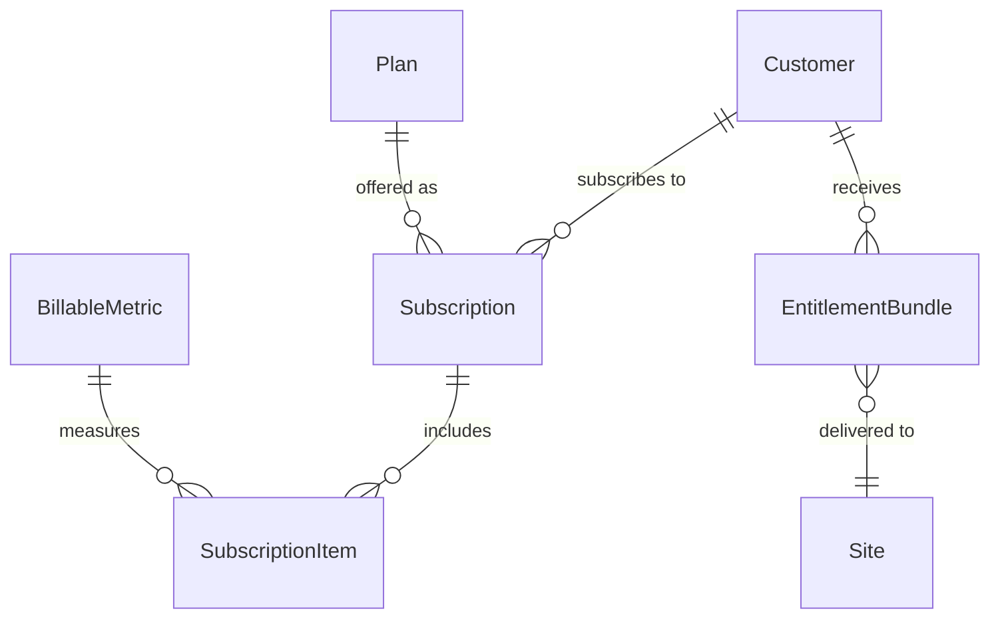
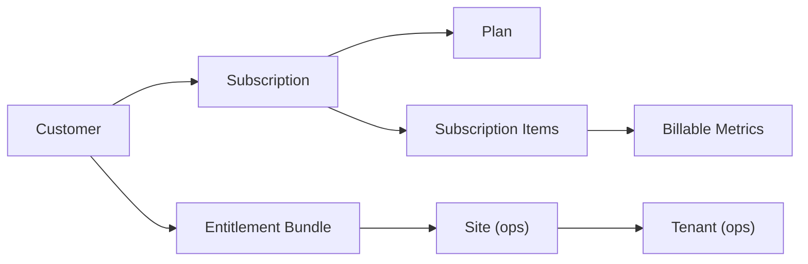

# commerce — Who Pays

> Commercial governance — customers, pricing, subscriptions, and entitlements.

## Overview

The `commerce` domain models the business side of software. **Customers** subscribe to **Plans**, creating **Subscriptions** with metered **Subscription Items**. Usage is tracked via **Billable Metrics**. The result is an **Entitlement Bundle** — a signed token delivered to sites for offline enforcement of what each customer can access.

## Entity Map



## Entities

### Customer

The buyer entity.

| Field  | Type   | Description                                            |
| ------ | ------ | ------------------------------------------------------ |
| slug   | string | Customer identifier                                    |
| name   | string | Display name                                           |
| type   | enum   | `direct`, `reseller`, `partner`                        |
| status | enum   | `trial`, `active`, `suspended`, `terminated`           |
| spec   | object | `{ billingEmail, company, stripeCustomerId, address }` |

**Example:**

```json
{
  "slug": "acme-corp",
  "name": "Acme Corporation",
  "type": "direct",
  "status": "active",
  "spec": {
    "billingEmail": "billing@acme.com",
    "company": "Acme Corporation",
    "stripeCustomerId": "cus_abc123"
  }
}
```

### Plan

Pricing tier — what customers can subscribe to.

| Field           | Type     | Description               |
| --------------- | -------- | ------------------------- |
| slug            | string   | Plan identifier           |
| name            | string   | Display name              |
| type            | enum     | `base`, `add-on`, `suite` |
| priceCents      | number   | Price in cents            |
| billingInterval | enum     | `monthly`, `yearly`       |
| capabilities    | string[] | Included features         |
| trialDays       | number?  | Free trial duration       |

**Example:**

```json
{
  "slug": "enterprise",
  "name": "Enterprise",
  "type": "base",
  "priceCents": 99900,
  "billingInterval": "monthly",
  "capabilities": ["ai-agents", "preview-environments", "multi-site", "sso"],
  "trialDays": 14
}
```

### Subscription

Active subscription linking a customer to a plan.

| Field              | Type    | Description                                             |
| ------------------ | ------- | ------------------------------------------------------- |
| customerId         | string  | The customer                                            |
| planId             | string  | The plan                                                |
| status             | enum    | `active`, `past_due`, `cancelled`, `trialing`, `paused` |
| currentPeriodStart | date    | Billing period start                                    |
| currentPeriodEnd   | date    | Billing period end                                      |
| cancelAtEnd        | boolean | Cancel at period end                                    |

### Subscription Item

Metered feature within a subscription.

| Field            | Type    | Description                      |
| ---------------- | ------- | -------------------------------- |
| subscriptionId   | string  | Parent subscription              |
| billableMetricId | string  | What's being measured            |
| status           | enum    | `active`, `suspended`, `revoked` |
| quantity         | number  | Included quantity                |
| usageLimit       | number? | Maximum usage                    |
| overagePolicy    | enum    | `block`, `charge`, `notify`      |

### Billable Metric

Measurement definition for usage-based billing.

| Field         | Type    | Description                             |
| ------------- | ------- | --------------------------------------- |
| slug          | string  | Metric identifier                       |
| name          | string  | Display name                            |
| aggregation   | enum    | `sum`, `count`, `max`, `unique`, `last` |
| eventName     | string  | Event to track                          |
| property      | string? | Event property to aggregate             |
| resetInterval | enum    | `monthly`, `yearly`, `never`            |

**Example:**

```json
{
  "slug": "api-calls",
  "name": "API Calls",
  "aggregation": "count",
  "eventName": "api.request",
  "resetInterval": "monthly"
}
```

### Entitlement Bundle

Signed capability token delivered to sites for offline enforcement.

| Field        | Type     | Description             |
| ------------ | -------- | ----------------------- |
| customerId   | string   | The customer            |
| siteId       | string   | Target site             |
| capabilities | string[] | Enabled features        |
| maxSites     | number?  | Site limit              |
| expiresAt    | date     | Bundle expiration       |
| signature    | string   | Cryptographic signature |

**Example:**

```json
{
  "customerId": "cust_acme",
  "siteId": "site_prod_us",
  "capabilities": ["ai-agents", "preview-environments", "multi-site", "sso"],
  "maxSites": 5,
  "expiresAt": "2027-01-01T00:00:00Z",
  "signature": "eyJhbGciOiJSUzI1NiIs..."
}
```

## The Commercial Flow



## Common Patterns

### Customer → Tenant Mapping

A customer typically maps to one or more tenants across sites:

```
Acme Corp (customer, enterprise plan)
  ├── production-us (site) → acme-prod (tenant, dedicated isolation)
  ├── production-eu (site) → acme-prod-eu (tenant, dedicated isolation)
  └── staging (site) → acme-staging (tenant, shared isolation)
```

### Entitlement Enforcement

Entitlement bundles are signed tokens delivered to sites. Sites check bundles locally — no round-trip to the central API needed. This enables air-gapped and offline deployments.

## Related

- [API: commerce](/api/commerce) — REST API for customers, plans, subscriptions
- [ops domain](/concepts/ops) — Sites and tenants that commerce controls
