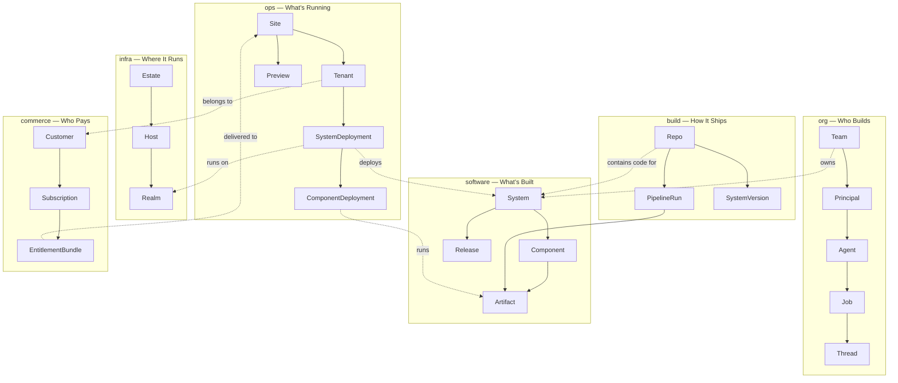

# The Factory Mental Model

Factory organizes every concept in your software organization into **six semantic domains** (database schemas). Together, they answer the fundamental questions of software production:

| Domain                             | Question           | Key Entities                                  |
| ---------------------------------- | ------------------ | --------------------------------------------- |
| [**org**](/concepts/org)           | Who builds?        | Teams, Principals, Agents, Threads, Memory    |
| [**software**](/concepts/software) | What's built?      | Systems, Components, Artifacts, Releases      |
| [**infra**](/concepts/infra)       | Where does it run? | Estate, Hosts, Realms, Services               |
| [**ops**](/concepts/ops)           | What's running?    | Sites, Tenants, Deployments, Previews         |
| [**build**](/concepts/build)       | How does it ship?  | Repos, Pipelines, Versions                    |
| [**commerce**](/concepts/commerce) | Who pays?          | Customers, Plans, Subscriptions, Entitlements |

## How the Domains Connect



## The Execution Flow

A typical journey through the domains:

```
1. A Team (org) owns a System (software)
2. The System has Components (software) — services, workers, databases
3. Code lives in a Repo (build) and is built by Pipeline Runs (build)
4. Pipelines produce Artifacts (build) — container images, binaries
5. Artifacts are deployed as Component Deployments (ops)
6. Deployments run on a Realm (infra) — a K8s cluster, Docker engine, etc.
7. The Realm lives on Hosts (infra) within an Estate (infra)
8. Deployments serve Tenants (ops) on a Site (ops)
9. Tenants belong to Customers (commerce) who have Subscriptions (commerce)
```

## Design Principles

### JSONB-First

Foreign keys and type discriminators are database columns. Everything else lives in `spec` (JSONB) or `metadata` (JSONB). This means:

- Adding a new component type (e.g., `ml-pipeline`) = add it to the TypeScript enum. Zero migrations.
- Adding a new field to a host spec = update the Zod schema. Zero migrations.
- The database schema is stable while the model evolves rapidly.

```typescript
// shared/src/schemas/infra.ts
export const HostSpecSchema = z.object({
  hostname: z.string(),
  os: OsSchema.default("linux"),
  arch: ArchSchema.default("amd64"),
  cpu: z.number().int().optional(),
  memoryMb: z.number().int().optional(),
  diskGb: z.number().int().optional(),
  ipAddress: z.string().optional(),
  // ... add new fields here, no migration needed
})
```

### Plain Text Types

All type/kind columns are `text` in Postgres. Validation happens in TypeScript via Zod enums. No database enums means no ALTER TYPE migrations.

```typescript
export const ComponentTypeSchema = z.enum([
  "service",
  "worker",
  "task",
  "cronjob",
  "website",
  "library",
  "cli",
  "agent",
  "gateway",
  "ml-model",
  "database",
  "cache",
  "queue",
  "storage",
  "search",
])
// Add a new type here — code deploy only, no migration
```

### Slug-Based Lookups

Entities reference each other by **slug** (human-readable identifier), not by UUID. Slugs are URL-safe, memorable, and work naturally in CLI commands:

```bash
dx infra host show factory-prod    # Not: dx infra host show host_a1b2c3d4
dx fleet site show production      # Not: dx fleet site show site_x9y8z7
```

### Bitemporal Tracking

Some entities track both **valid time** (when the fact was true in the real world) and **system time** (when it was recorded):

```typescript
export const BitemporalSchema = z.object({
  validFrom: z.coerce.date().optional(),
  validTo: z.coerce.date().optional(),
  systemFrom: z.coerce.date().optional(),
  systemTo: z.coerce.date().optional(),
})
```

This enables queries like: "What was the team structure on March 1st?" and "When was this change recorded?"

### Reconciliation Pattern

Entities with desired vs actual state use a generation-based reconciliation pattern:

```typescript
export const ReconciliationSchema = z.object({
  status: z.string().optional(), // Current observed state
  generation: z.number().default(0), // Desired state version
  observedGeneration: z.number().default(0), // Last reconciled version
})
```

When `generation > observedGeneration`, the reconciler knows work needs to be done.

### Entity Metadata

Every entity carries Backstage-style metadata (JSONB):

```typescript
export const EntityMetadataSchema = z.object({
  labels: z.record(z.string()).optional(), // Key-value for filtering
  annotations: z.record(z.string()).optional(), // Key-value for tooling
  tags: z.array(z.string()).optional(), // String array for grouping
  links: z
    .array(
      z.object({
        url: z.string(),
        title: z.string().optional(),
        type: z.string().optional(),
      })
    )
    .optional(),
})
```

## Entity Count

Across all six domains, Factory models approximately **55 entity types**. The schemas are defined in `shared/src/schemas/*.ts` and the database tables in `api/src/db/schema/*.ts`.
