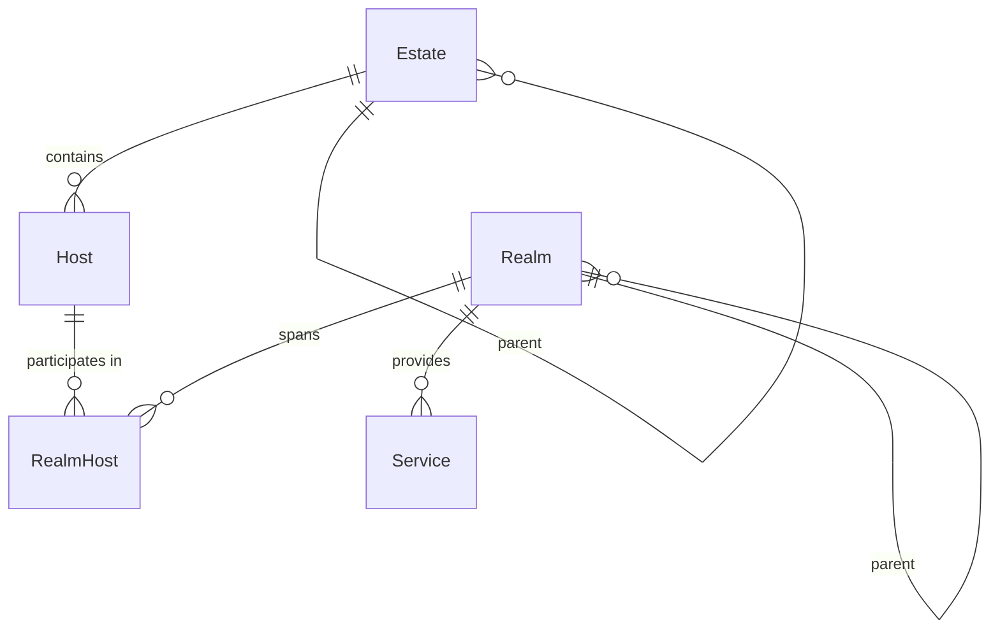

# infra — Where Things Run

> Two-axis model for infrastructure: ownership (Estate) and control (Host + Realm).

## Overview

The `infra` domain models the physical and virtual substrate that software runs on. It uses a **two-axis approach**:

- **Estate** — The ownership hierarchy: cloud accounts, regions, datacenters, VPCs, subnets. Answers "who owns this?" and "where does the bill go?"
- **Host + Realm** — The operational control axis: what machines exist (Host) and what control planes govern them (Realm). Answers "what can I deploy to?"

Estate types and Realm types are plain text validated in TypeScript — add new infrastructure types without database migrations.

## Entity Map



## Entities

### Estate

Recursive ownership hierarchy. Every piece of infrastructure belongs somewhere in the estate tree.

| Field          | Type    | Description                 |
| -------------- | ------- | --------------------------- |
| id             | string  | Unique identifier           |
| slug           | string  | URL-safe identifier         |
| name           | string  | Display name                |
| type           | enum    | See types below             |
| parentEstateId | string? | Parent in hierarchy         |
| spec           | object  | Type-specific configuration |

**Types:** `cloud-account`, `region`, `datacenter`, `vpc`, `subnet`, `rack`, `dns-zone`, `wan`, `cdn`

**Key spec fields:**

- `providerKind` — Open string: `aws`, `gcp`, `azure`, `proxmox`, `hetzner`, `cloudflare`, etc.
- `credentialsRef` — Reference to stored credentials
- `lifecycle` — `active`, `maintenance`, `decommissioned`
- Type-specific: `cidr`, `gatewayIp` (subnet), `dnsProvider`, `zone` (dns-zone), `apiHost`, `tokenId` (proxmox)

**Example estate tree:**

```
Hetzner Account (cloud-account)
  └── EU-Central (region)
      └── Falkenstein DC (datacenter)
          ├── Production VPC (vpc)
          │   ├── App Subnet 10.0.1.0/24 (subnet)
          │   └── DB Subnet 10.0.2.0/24 (subnet)
          └── Rack A3 (rack)
```

### Host

Physical or virtual machine — the compute substrate.

| Field          | Type    | Description                                                      |
| -------------- | ------- | ---------------------------------------------------------------- |
| id             | string  | Unique identifier                                                |
| slug           | string  | URL-safe identifier                                              |
| name           | string  | Display name                                                     |
| type           | enum    | `bare-metal`, `vm`, `lxc`, `cloud-instance`, `network-appliance` |
| parentEstateId | string? | Where in the estate tree                                         |
| spec           | object  | Machine configuration                                            |

**Key spec fields:**

| Field        | Type   | Description                                          |
| ------------ | ------ | ---------------------------------------------------- |
| hostname     | string | Network hostname                                     |
| os           | enum   | `linux`, `windows`, `macos`                          |
| arch         | enum   | `amd64`, `arm64`                                     |
| cpu          | number | CPU cores                                            |
| memoryMb     | number | RAM in MB                                            |
| diskGb       | number | Disk in GB                                           |
| ipAddress    | string | Primary IP                                           |
| sshUser      | string | SSH username                                         |
| sshPort      | number | SSH port (default 22)                                |
| accessMethod | enum   | `ssh`, `winrm`, `rdp`                                |
| lifecycle    | enum   | `active`, `maintenance`, `offline`, `decommissioned` |

**Example:**

```json
{
  "slug": "factory-prod",
  "name": "Factory Production",
  "type": "vm",
  "spec": {
    "hostname": "factory-prod.internal",
    "os": "linux",
    "arch": "amd64",
    "cpu": 8,
    "memoryMb": 32768,
    "diskGb": 500,
    "ipAddress": "192.168.2.88",
    "sshUser": "lepton",
    "lifecycle": "active"
  }
}
```

### Realm

Active governance domain where workloads spawn and are controlled. This is the key abstraction — a realm represents a "place where things can run."

| Field         | Type    | Description                                                  |
| ------------- | ------- | ------------------------------------------------------------ |
| id            | string  | Unique identifier                                            |
| slug          | string  | URL-safe identifier                                          |
| name          | string  | Display name                                                 |
| type          | string  | Category-specific type (see below)                           |
| category      | enum    | `compute`, `network`, `storage`, `ai`, `build`, `scheduling` |
| parentRealmId | string? | Parent realm for nesting                                     |
| spec          | object  | Type-specific configuration                                  |

**Types by category:**

| Category       | Types                                                                                                      |
| -------------- | ---------------------------------------------------------------------------------------------------------- |
| **Compute**    | `k8s-cluster`, `k8s-namespace`, `docker-engine`, `compose-project`, `systemd`, `process`, `proxmox`, `kvm` |
| **Network**    | `reverse-proxy`, `firewall`, `router`, `load-balancer`, `vpn-gateway`, `service-mesh`                      |
| **Storage**    | `ceph`, `zfs-pool`, `nfs-server`, `minio`, `glusterfs`, `lvm`                                              |
| **AI/ML**      | `ollama`, `vllm`, `triton-server`, `tgi`                                                                   |
| **Build**      | `docker-buildkit`, `nix-daemon`, `bazel-remote`                                                            |
| **Scheduling** | `temporal-server`, `airflow-scheduler`, `inngest`, `celery-worker`                                         |

Uses the reconciliation pattern: `status`, `generation`, `observedGeneration`.

**Example:**

```json
{
  "slug": "prod-k8s",
  "name": "Production Kubernetes",
  "type": "k8s-cluster",
  "category": "compute",
  "spec": {
    "kubeVersion": "1.29",
    "nodeCount": 5,
    "endpoint": "https://k8s.prod.internal:6443"
  }
}
```

### Realm-Host

Many-to-many join — a K8s cluster spans multiple hosts, and a host can participate in multiple realms.

| Field   | Type   | Description                         |
| ------- | ------ | ----------------------------------- |
| realmId | string | The realm                           |
| hostId  | string | The host                            |
| role    | enum   | `single`, `control-plane`, `worker` |

### Service

Anything consumed via protocol/API — managed databases, caches, LLMs, issue trackers, payment processors. Links to estate for billing traceability.

| Field    | Type    | Description                                                    |
| -------- | ------- | -------------------------------------------------------------- |
| slug     | string  | Service identifier                                             |
| name     | string  | Display name                                                   |
| type     | string  | Open string (e.g., `postgres`, `redis`, `anthropic`, `stripe`) |
| estateId | string? | Billing/account link                                           |
| spec     | object  | `{ endpoint, version, credentials }`                           |

## Common Patterns

### Infrastructure Topology

```
Estate (ownership)                 Host + Realm (control)
├── AWS Account                    ├── host-1 (bare-metal)
│   ├── us-east-1 (region)        │   └── k8s-cluster (realm, role: control-plane)
│   │   ├── VPC (vpc)             ├── host-2 (bare-metal)
│   │   └── Subnet (subnet)      │   └── k8s-cluster (realm, role: worker)
│   └── eu-west-1 (region)       ├── host-3 (vm)
└── Proxmox (cloud-account)       │   ├── docker-engine (realm)
    └── DC1 (datacenter)          │   └── traefik (realm, network)
                                  └── host-4 (network-appliance)
                                      └── firewall (realm, network)
```

### Two-Axis Resolution

To answer "where should I deploy this?":

1. **Estate** tells you what accounts/regions/DCs are available (ownership)
2. **Host** tells you what machines are there (compute)
3. **Realm** tells you what control planes are running (where to actually deploy)

## Related

- [CLI: dx infra](/cli/infra) — Manage infrastructure entities
- [CLI: dx scan](/cli/scan) — Discover infrastructure
- [API: infra](/api/infra) — REST API for estate, hosts, realms
- [Guide: Infrastructure](/guides/infrastructure) — Managing infrastructure
