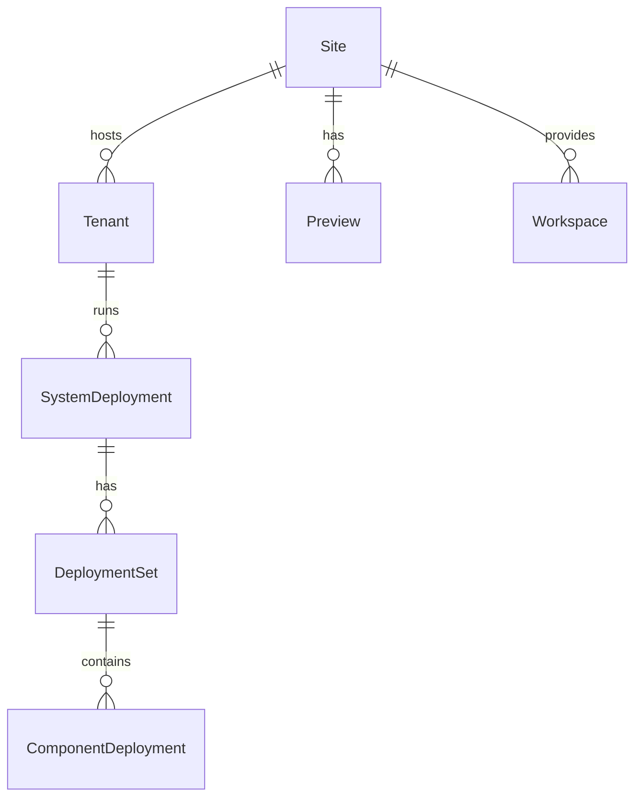
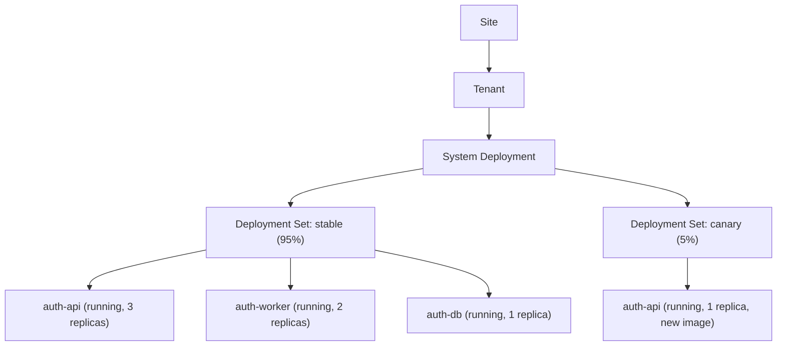

# ops — What Is Running

> Deployment and runtime topology — sites, tenants, and the live state of your software.

## Overview

The `ops` domain tracks the runtime state of software. It answers: where is this system deployed? who is it deployed for? what version is running? what's the drift between desired and actual state?

A **Site** is a purpose container (like "production-us-east"). A **Tenant** is a customer or team isolated within a site. **System Deployments** track what's actually running, broken down into **Deployment Sets** (traffic tiers) and **Component Deployments** (per-component state).

## Entity Map



## Entities

### Site

Purpose container for deployments. A site represents a logical deployment boundary.

| Field              | Type   | Description                                             |
| ------------------ | ------ | ------------------------------------------------------- |
| id                 | string | Unique identifier                                       |
| slug               | string | URL-safe identifier                                     |
| name               | string | Display name                                            |
| spec.type          | enum   | `shared`, `dedicated`, `on-prem`, `edge`                |
| spec.status        | enum   | `provisioning`, `active`, `suspended`, `decommissioned` |
| spec.previewConfig | object | `{ enabled, registry, defaultAuthMode, containerPort }` |

**Types:**

- **shared** — Multi-tenant SaaS deployment
- **dedicated** — Single-tenant dedicated infrastructure
- **on-prem** — Customer-hosted deployment
- **edge** — Edge location deployment

**Example:**

```json
{
  "slug": "production-us",
  "name": "Production US",
  "spec": {
    "type": "shared",
    "status": "active",
    "previewConfig": {
      "enabled": true,
      "defaultAuthMode": "team"
    }
  }
}
```

### Tenant

Customer or internal team scoped to a site. Tenants control isolation and resource allocation.

| Field              | Type    | Description                                             |
| ------------------ | ------- | ------------------------------------------------------- |
| slug               | string  | Tenant identifier                                       |
| siteId             | string  | Parent site                                             |
| customerId         | string? | Links to commerce.customer                              |
| spec.environment   | enum    | `production`, `staging`, `development`, `preview`       |
| spec.isolation     | enum    | `dedicated`, `shared`, `siloed`                         |
| spec.status        | enum    | `provisioning`, `active`, `suspended`, `decommissioned` |
| spec.k8sNamespace  | string? | Kubernetes namespace                                    |
| spec.resourceQuota | object  | `{ cpu, memory, storage }`                              |

**Isolation modes:**

- **dedicated** — Own infrastructure (single tenant on site)
- **shared** — Shared infra, app-level isolation (Row-Level Security, tenant ID)
- **siloed** — Shared infra, infra-level isolation (own K8s namespace, own pods)

### Workspace

Developer or agent isolated compute environment.

| Field     | Type   | Description                                               |
| --------- | ------ | --------------------------------------------------------- |
| slug      | string | Workspace identifier                                      |
| type      | enum   | `developer`, `agent`, `ci`, `playground`                  |
| ownerType | enum   | `user`, `agent`                                           |
| health    | enum   | `unknown`, `building`, `ready`, `unhealthy`, `terminated` |
| spec      | object | `{ cpu, memory, storageGb, expiresAt }`                   |

### Workbench

Generalized compute environment abstraction. Covers all ways code can run.

**Types:** `worktree`, `container`, `vm`, `namespace`, `pod`, `bare-process`, `function`, `sandbox`, `edge-worker`, `static`

### System Deployment

Running instance of a system on a site/tenant/realm.

| Field    | Type    | Description                                   |
| -------- | ------- | --------------------------------------------- |
| systemId | string  | Which system (software domain)                |
| siteId   | string  | Where it runs                                 |
| tenantId | string? | For which tenant                              |
| realmId  | string  | On which realm (infra domain)                 |
| kind     | enum    | `production`, `staging`, `dev`                |
| strategy | enum    | `rolling`, `blue-green`, `canary`, `stateful` |

**Example:**

```json
{
  "slug": "auth-platform-prod-us",
  "systemId": "sys_auth",
  "siteId": "site_prod_us",
  "realmId": "realm_k8s_prod",
  "kind": "production",
  "strategy": "rolling"
}
```

### Deployment Set

Traffic tier within a system deployment. Enables blue/green, canary, and replica routing.

| Field              | Type    | Description                                  |
| ------------------ | ------- | -------------------------------------------- |
| systemDeploymentId | string  | Parent deployment                            |
| name               | string  | Tier name (e.g., `active`, `blue`, `canary`) |
| realmId            | string? | Can target a different realm                 |
| trafficWeight      | number  | 0-100 traffic percentage                     |

**Common patterns:**

- Single tier: `active` (100%)
- Blue/green: `blue` (100%) + `green` (0%), then swap
- Canary: `stable` (95%) + `canary` (5%)
- Primary/replica: `primary` (100%) + `replica` (read-only)

### Component Deployment

Running instance of a specific component. The most granular deployment unit.

| Field             | Type    | Description                                                             |
| ----------------- | ------- | ----------------------------------------------------------------------- |
| deploymentSetId   | string  | Parent deployment set                                                   |
| componentId       | string  | Which component (software domain)                                       |
| artifactId        | string  | Which artifact (build output)                                           |
| status            | enum    | `provisioning`, `running`, `degraded`, `stopped`, `failed`, `completed` |
| replicas          | number  | Running replica count                                                   |
| desiredImage      | string  | Expected container image                                                |
| actualImage       | string  | Actual running image                                                    |
| driftDetected     | boolean | Desired != actual                                                       |
| envOverrides      | object  | Runtime env var overrides                                               |
| resourceOverrides | object  | CPU/memory overrides                                                    |

### Preview

Ephemeral deployment for PR/branch testing.

| Field        | Type   | Description                                                   |
| ------------ | ------ | ------------------------------------------------------------- |
| siteId       | string | Parent site                                                   |
| branch       | string | Git branch                                                    |
| status       | enum   | `pending_image`, `building`, `deploying`, `active`, `expired` |
| ttl          | string | Time to live (e.g., `72h`)                                    |
| authMode     | enum   | `public`, `team`, `private`                                   |
| runtimeClass | enum   | `hot`, `warm`, `cold`                                         |
| url          | string | Preview URL                                                   |

**Runtime classes:**

- **hot** — Always running, fastest response
- **warm** — Scale-to-zero, cold start on first request
- **cold** — On-demand provisioning

### Database

Operational database instance.

| Field         | Type   | Description                                      |
| ------------- | ------ | ------------------------------------------------ |
| engine        | enum   | `postgres`, `mysql`, `redis`, `mongodb`          |
| provisionMode | enum   | `sidecar`, `managed`, `external`                 |
| spec          | object | `{ version, storage, backupConfig, seedConfig }` |

### Workspace Snapshot

Point-in-time disk state for cloning/restoring workspaces.

| Field       | Type   | Description                              |
| ----------- | ------ | ---------------------------------------- |
| workspaceId | string | Source workspace                         |
| status      | enum   | `creating`, `ready`, `failed`, `deleted` |
| sizeBytes   | number | Snapshot size                            |

## The Deployment Hierarchy



## Related

- [CLI: dx deploy](/cli/deploy) — Deploy releases
- [CLI: dx preview](/cli/preview) — Manage previews
- [CLI: dx fleet](/cli/fleet) — Manage sites and tenants
- [API: ops](/api/ops) — REST API for deployments
- [Guide: Deploying](/guides/deploying) — Deployment strategies
