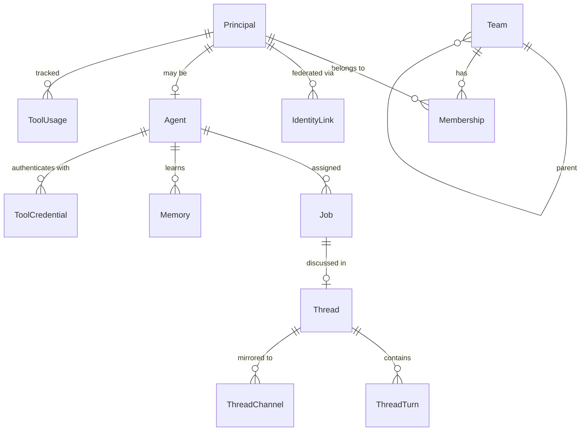

# org — Actors & Identity

> System of record for who builds, who operates, and how they collaborate.

## Overview

The `org` domain models every actor in your software organization — human developers, AI agents, and service accounts — along with how they're organized into teams, how they communicate via threads, and how agents learn via memory.

Every request in Factory traces back to a **Principal** (the "who"). Principals are organized into **Teams**, and teams own systems, components, and infrastructure. AI **Agents** are a specialized kind of principal with autonomy levels, jobs, and memory.

## Entity Map



## Entities

### Team

Hierarchical organizational unit. Teams own systems, components, and infrastructure.

| Field        | Type    | Description                                |
| ------------ | ------- | ------------------------------------------ |
| id           | string  | Unique identifier                          |
| slug         | string  | URL-safe identifier                        |
| name         | string  | Display name                               |
| type         | enum    | `team`, `business-unit`, `product-area`    |
| parentTeamId | string? | Parent team for nesting                    |
| spec         | object  | `{ description, slackChannel, oncallUrl }` |

**Example:**

```json
{
  "id": "team_abc123",
  "slug": "platform-eng",
  "name": "Platform Engineering",
  "type": "team",
  "parentTeamId": null,
  "spec": {
    "description": "Core platform infrastructure team",
    "slackChannel": "#platform-eng",
    "oncallUrl": "https://pagerduty.com/platform-eng"
  }
}
```

### Principal

Universal actor — the "who" behind every request.

| Field         | Type    | Description                                             |
| ------------- | ------- | ------------------------------------------------------- |
| id            | string  | Unique identifier                                       |
| slug          | string  | URL-safe identifier                                     |
| name          | string  | Display name                                            |
| type          | enum    | `human`, `agent`, `service-account`                     |
| primaryTeamId | string? | Primary team membership                                 |
| spec          | object  | `{ authUserId, avatarUrl, email, displayName, status }` |

**Types:**

- **human** — A developer, PM, or operator
- **agent** — An AI agent (extends to the Agent entity for agent-specific fields)
- **service-account** — A system-to-system credential

### Membership

Joins a principal to a team with a role.

| Field       | Type   | Description               |
| ----------- | ------ | ------------------------- |
| principalId | string | The principal             |
| teamId      | string | The team                  |
| spec.role   | enum   | `member`, `lead`, `admin` |

A principal can belong to multiple teams with different roles.

### Scope

Authorization boundary for access control.

| Field            | Type     | Description                  |
| ---------------- | -------- | ---------------------------- |
| type             | enum     | `team`, `resource`, `custom` |
| spec.permissions | string[] | Permission strings           |

### Identity Link

Federated identity — connects external accounts to a principal.

| Field       | Type   | Description                                             |
| ----------- | ------ | ------------------------------------------------------- |
| principalId | string | The factory principal                                   |
| provider    | enum   | `github`, `google`, `slack`, `jira`, `claude`, `cursor` |
| externalId  | string | ID in the external system                               |
| spec        | object | Provider-specific details                               |

### Agent

Specialized principal with autonomy, collaboration, and memory. Extends Principal where `type = "agent"`.

| Field           | Type     | Description                                                 |
| --------------- | -------- | ----------------------------------------------------------- |
| principalId     | string   | Links to principal                                          |
| autonomy        | enum     | `observer`, `advisor`, `executor`, `operator`, `supervisor` |
| collaboration   | enum     | `solo`, `pair`, `crew`, `hierarchy`                         |
| relationship    | enum     | `personal`, `team`, `org`                                   |
| trustScore      | number   | 0-100, computed from track record                           |
| systemPrompt    | string   | Agent's base instructions                                   |
| toolPermissions | string[] | Allowed tool IDs                                            |

**Autonomy levels:**

- **observer** — Read-only, monitors and reports
- **advisor** — Suggests actions, human approves
- **executor** — Acts autonomously within guardrails
- **operator** — Full operational control of assigned systems
- **supervisor** — Manages other agents

**Example:**

```json
{
  "principalId": "principal_agent_xyz",
  "autonomy": "executor",
  "collaboration": "pair",
  "relationship": "team",
  "trustScore": 85,
  "systemPrompt": "You are a code review agent for the platform team...",
  "toolPermissions": ["bash", "dx-cli", "github-pr"]
}
```

### Job

Work unit assigned to an agent.

| Field    | Type    | Description                                                         |
| -------- | ------- | ------------------------------------------------------------------- |
| agentId  | string  | Assigned agent                                                      |
| threadId | string? | Discussion thread                                                   |
| status   | enum    | `pending`, `claimed`, `running`, `completed`, `failed`, `cancelled` |
| priority | enum    | `low`, `medium`, `high`, `critical`                                 |
| deadline | date?   | When it's due                                                       |
| spec     | object  | Job-specific parameters                                             |

### Thread

Universal conversation primitive. Every multi-turn interaction — IDE session, Slack chat, terminal session, code review — is a thread.

| Field        | Type     | Description                                               |
| ------------ | -------- | --------------------------------------------------------- |
| type         | enum     | `ide-session`, `chat`, `terminal`, `review`, `autonomous` |
| title        | string   | Thread subject                                            |
| participants | string[] | Principal IDs                                             |
| pinned       | boolean  | Whether thread is pinned                                  |

### Thread Turn

Single request-response exchange within a thread.

| Field      | Type     | Description                                   |
| ---------- | -------- | --------------------------------------------- |
| threadId   | string   | Parent thread                                 |
| prompt     | string   | Input/request                                 |
| response   | string   | Output/response                               |
| toolCalls  | object[] | Tool invocations                              |
| tokenUsage | object   | `{ input, output, total }`                    |
| model      | string   | Model used (e.g., `claude-sonnet-4-20250514`) |

### Thread Channel

Multi-surface mirroring — a thread can appear in multiple places.

| Field       | Type   | Description                                                                              |
| ----------- | ------ | ---------------------------------------------------------------------------------------- |
| threadId    | string | The thread                                                                               |
| channelType | enum   | `ide`, `conductor-workspace`, `slack`, `terminal`, `github-pr`, `github-issue`, `web-ui` |
| channelRef  | string | External reference (e.g., Slack channel ID)                                              |

### Memory

Agent-learned facts that persist across sessions.

| Field      | Type   | Description                          |
| ---------- | ------ | ------------------------------------ |
| agentId    | string | Owning agent                         |
| content    | string | The learned fact                     |
| layer      | enum   | `session`, `team`, `org`             |
| lifecycle  | enum   | `proposed`, `approved`, `superseded` |
| confidence | number | 0-1 confidence score                 |

### Tool Credential

Encrypted API key or token for agent tool access.

| Field         | Type   | Description          |
| ------------- | ------ | -------------------- |
| principalId   | string | Owning principal     |
| toolId        | string | Tool identifier      |
| credentialEnc | string | Encrypted credential |

### Tool Usage

Cost and usage tracking per principal per tool.

| Field       | Type   | Description     |
| ----------- | ------ | --------------- |
| principalId | string | The principal   |
| toolId      | string | Tool identifier |
| tokenCount  | number | Tokens consumed |
| costCents   | number | Cost in cents   |

## Common Patterns

### Team Hierarchy

```
Engineering (business-unit)
  ├── Platform (team)
  │     ├── Alice (human, lead)
  │     ├── Bob (human, member)
  │     └── CodeReviewer (agent, member)
  └── Product (team)
        ├── Carol (human, lead)
        └── TriageBot (agent, member)
```

### Agent Work Loop

```
1. Job created (by workflow, human, or another agent)
2. Agent claims the job
3. Thread created for discussion
4. Agent works through turns (prompt → response → tool calls)
5. Thread mirrored to Slack/IDE/GitHub via channels
6. Job completed, memory updated
```

## Related

- [CLI: dx org](/cli/) — Manage org entities
- [API: org](/api/org) — REST API for teams, principals, agents
- [Guide: AI Agents](/guides/agents) — Working with agents
