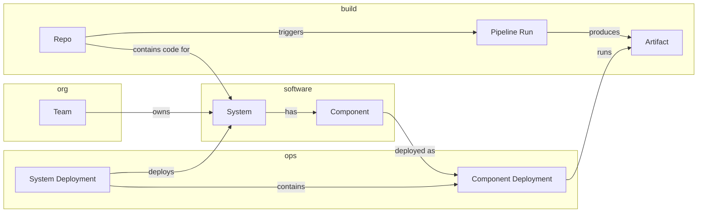
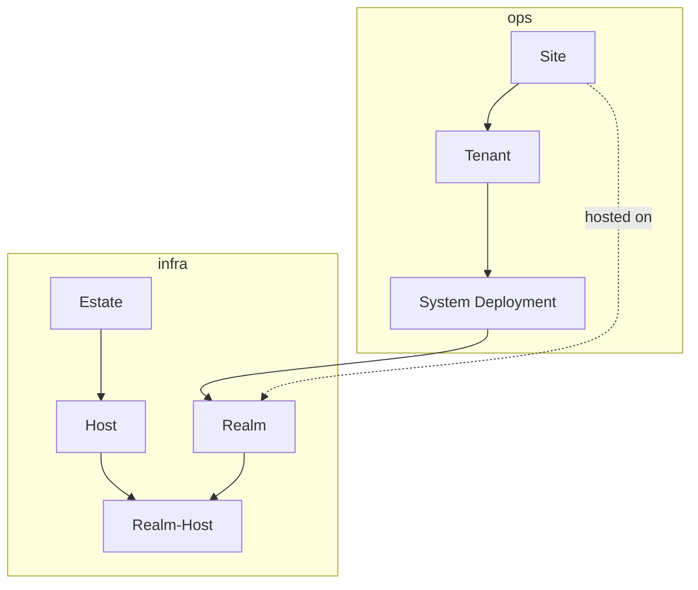
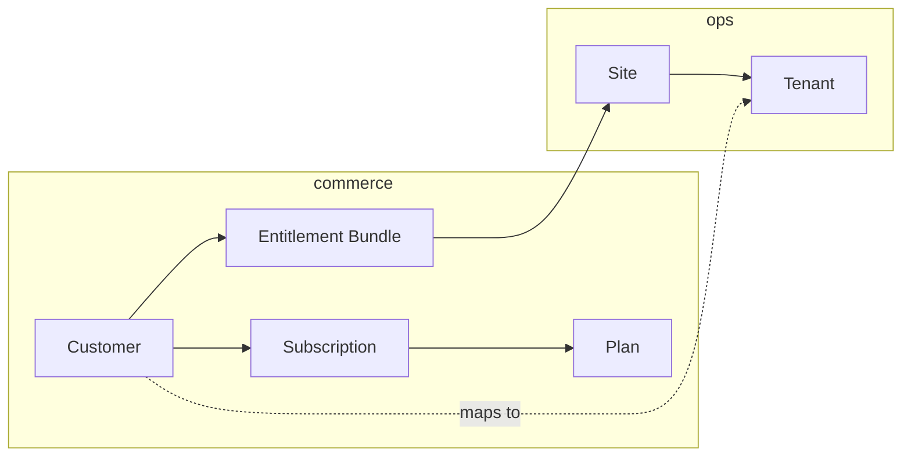
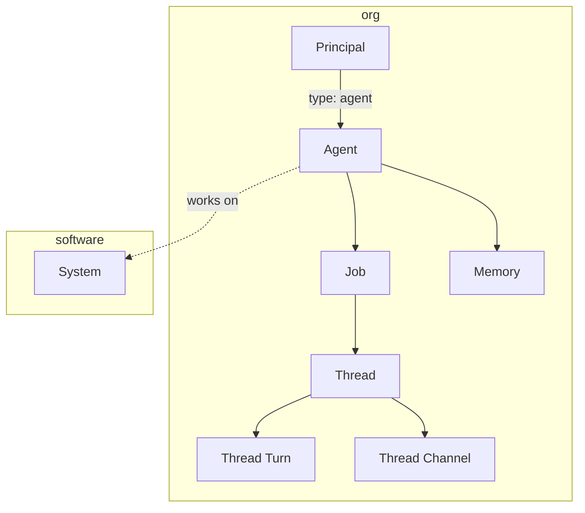

# Entity Relationships

> How the six domains connect into a coherent platform.

## The Full Picture

Every entity in Factory connects to entities in other domains via foreign keys. These cross-domain relationships are what make Factory a unified platform rather than six separate databases.

## Cross-Domain Diagrams

### The Software Lifecycle

From code to running deployment:



### The Infrastructure Stack

Where deployments land:



### The Commercial Bridge

Who pays for what:



### The Agent Loop

How agents work:



## Key Foreign Keys

| Source                                | Target                  | Relationship               |
| ------------------------------------- | ----------------------- | -------------------------- |
| `ops.tenant.customerId`               | `commerce.customer.id`  | Tenant belongs to customer |
| `ops.systemDeployment.systemId`       | `software.system.id`    | Deploys a system           |
| `ops.systemDeployment.realmId`        | `infra.realm.id`        | Runs on a realm            |
| `ops.systemDeployment.siteId`         | `ops.site.id`           | Within a site              |
| `ops.componentDeployment.componentId` | `software.component.id` | Deploys a component        |
| `ops.componentDeployment.artifactId`  | `software.artifact.id`  | Runs an artifact           |
| `build.repo.systemId`                 | `software.system.id`    | Code for a system          |
| `build.repo.teamId`                   | `org.team.id`           | Owned by a team            |
| `software.system.ownerTeamId`         | `org.team.id`           | Owned by a team            |
| `software.component.systemId`         | `software.system.id`    | Part of a system           |
| `infra.host.parentEstateId`           | `infra.estate.id`       | Located in estate          |
| `infra.realm_host.realmId`            | `infra.realm.id`        | Realm spans hosts          |
| `infra.realm_host.hostId`             | `infra.host.id`         | Host in realm              |
| `org.membership.principalId`          | `org.principal.id`      | Principal in team          |
| `org.membership.teamId`               | `org.team.id`           | Team has members           |
| `org.agent.principalId`               | `org.principal.id`      | Agent is a principal       |
| `commerce.entitlementBundle.siteId`   | `ops.site.id`           | Delivered to site          |

## End-to-End Trace

Follow a single request through all six domains:

```
1. Carol (principal, org) is on the Platform team (team, org)
2. Platform team owns Auth Platform (system, software)
3. Auth Platform has auth-api (component, software) and auth-db (component, software)
4. Code lives in factory/auth-platform (repo, build)
5. Carol pushes a commit, triggering a Pipeline Run (build)
6. Pipeline produces auth-api:v2.1.0 (artifact, build)
7. Auth Platform v2.1.0 (system version, build) is tagged
8. A Release (ops) is created bundling the artifacts
9. The release is deployed as a System Deployment (ops)
10. It runs on prod-k8s (realm, infra) on factory-prod (host, infra)
11. The host is in Falkenstein DC (estate, infra)
12. It serves Acme Corp (customer, commerce) via their tenant (ops)
13. Acme's Entitlement Bundle (commerce) authorizes the AI module
```
