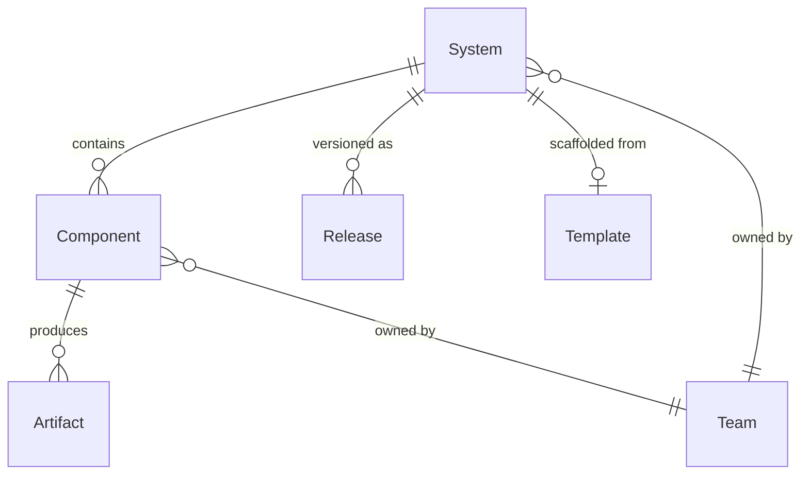
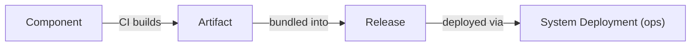

# software — What Gets Built

> System of record for all software assets — from microservices to databases.

## Overview

The `software` domain defines what your organization builds. A **System** is the top-level product or platform. Systems contain **Components** — the individual units of software (services, workers, databases, etc.). Components produce **Artifacts** (container images, binaries) that get bundled into **Releases**.

The key insight is that components are type-discriminated: application components (services, workers) have source code and are built from CI, while infrastructure components (databases, caches) are provisioned, not built. Both live in the same model.

## Entity Map



## Entities

### System

Top-level product or platform. The highest organizational unit of software.

| Field       | Type    | Description                       |
| ----------- | ------- | --------------------------------- |
| id          | string  | Unique identifier                 |
| slug        | string  | URL-safe identifier               |
| name        | string  | Display name                      |
| ownerTeamId | string  | Team that owns this system        |
| namespace   | string? | Organizational namespace          |
| lifecycle   | enum    | `active`, `deprecated`, `retired` |
| spec        | object  | System-specific configuration     |

**Example:**

```json
{
  "slug": "auth-platform",
  "name": "Auth Platform",
  "ownerTeamId": "team_platform",
  "lifecycle": "active",
  "spec": {
    "description": "Authentication and authorization platform",
    "repository": "factory/auth-platform"
  }
}
```

### Component

Unit of software within a system. Type-discriminated into two categories.

| Field    | Type   | Description                 |
| -------- | ------ | --------------------------- |
| id       | string | Unique identifier           |
| slug     | string | URL-safe identifier         |
| name     | string | Display name                |
| systemId | string | Parent system               |
| type     | enum   | See types below             |
| spec     | object | Type-specific configuration |

**Application types** (have source code, built from CI):

| Type       | Description                    |
| ---------- | ------------------------------ |
| `service`  | Long-running HTTP/gRPC server  |
| `worker`   | Background job processor       |
| `task`     | One-shot execution             |
| `cronjob`  | Scheduled execution            |
| `website`  | Static or SSR web application  |
| `library`  | Shared code package            |
| `cli`      | Command-line tool              |
| `agent`    | AI agent service               |
| `gateway`  | API gateway / reverse proxy    |
| `ml-model` | Machine learning model serving |

**Infrastructure types** (provisioned, not built):

| Type       | Description                                |
| ---------- | ------------------------------------------ |
| `database` | Relational or document database            |
| `cache`    | In-memory cache (Redis, Memcached)         |
| `queue`    | Message queue (RabbitMQ, SQS)              |
| `storage`  | Object or file storage (S3, MinIO)         |
| `search`   | Search engine (Elasticsearch, Meilisearch) |

**Service component spec example:**

```json
{
  "slug": "auth-api",
  "name": "Auth API",
  "systemId": "sys_auth",
  "type": "service",
  "spec": {
    "ports": [{ "name": "http", "port": 8080, "protocol": "http" }],
    "healthcheck": {
      "type": "http",
      "path": "/health",
      "intervalSeconds": 30
    },
    "replicas": { "min": 2, "max": 10 },
    "resources": {
      "cpu": "500m",
      "memory": "512Mi"
    }
  }
}
```

**Database component spec example:**

```json
{
  "slug": "auth-db",
  "name": "Auth Database",
  "systemId": "sys_auth",
  "type": "database",
  "spec": {
    "engine": "postgres",
    "version": "16",
    "provisionMode": "sidecar",
    "storage": "10Gi"
  }
}
```

### API

Declared interface of a component.

| Field       | Type   | Description                               |
| ----------- | ------ | ----------------------------------------- |
| componentId | string | Owning component                          |
| type        | enum   | `rest`, `grpc`, `graphql`, `event`, `cli` |
| spec        | object | `{ specUrl, version, description }`       |

### Artifact

Built output — container image, binary, or package. Immutable and content-addressable.

| Field       | Type   | Description                                       |
| ----------- | ------ | ------------------------------------------------- |
| id          | string | Unique identifier                                 |
| componentId | string | Source component                                  |
| type        | enum   | `container-image`, `binary`, `archive`, `package` |
| commitSha   | string | Git commit that produced this                     |
| spec        | object | `{ imageRef, imageDigest, sizeBytes }`            |

**Example:**

```json
{
  "slug": "auth-api-abc1234",
  "componentId": "comp_auth_api",
  "type": "container-image",
  "commitSha": "abc1234def5678",
  "spec": {
    "imageRef": "registry.factory.dev/auth-api:abc1234",
    "imageDigest": "sha256:a1b2c3d4...",
    "sizeBytes": 145000000
  }
}
```

### Release

Tagged, reproducible version of a system and its artifacts.

| Field        | Type     | Description                      |
| ------------ | -------- | -------------------------------- |
| systemId     | string   | Parent system                    |
| version      | string   | Semantic version (e.g., `2.1.0`) |
| commitSha    | string   | Git commit                       |
| releaseNotes | string?  | Changelog                        |
| artifacts    | string[] | Artifact IDs included            |

### Template

Reusable workspace definition for scaffolding new projects.

| Field | Type   | Description                                |
| ----- | ------ | ------------------------------------------ |
| slug  | string | Template identifier                        |
| name  | string | Display name                               |
| spec  | object | `{ devcontainer, dependencies, commands }` |

## Common Patterns

### System with Mixed Components

A typical system has both application and infrastructure components:

```
Auth Platform (system)
  ├── auth-api (service)        → built from CI, deployed as container
  ├── auth-worker (worker)      → built from CI, processes background jobs
  ├── auth-db (database)        → provisioned PostgreSQL instance
  ├── auth-cache (cache)        → provisioned Redis instance
  └── auth-events (queue)       → provisioned message queue
```

### Component → Artifact → Release Flow



## Related

- [CLI: dx catalog](/cli/catalog) — Browse the software catalog
- [API: software](/api/software) — REST API for systems, components, artifacts
- [Guide: Software Catalog](/guides/catalog) — Working with the catalog
- [ops domain](/concepts/ops) — How software gets deployed
