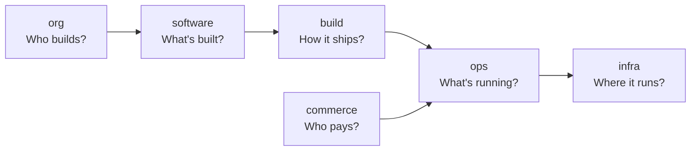

# What is Factory?

Factory is a platform that models your entire software organization — who builds, what's built, where it runs, how it ships, and who pays. It provides a unified data model, a convention-based CLI, and a full-stack platform that both human developers and AI agents use to ship high-quality software fast.

## The Six Domains

Factory organizes everything into six semantic domains:



| Domain       | Contains                               | Example                                             |
| ------------ | -------------------------------------- | --------------------------------------------------- |
| **org**      | Teams, people, agents, conversations   | "Platform Engineering team, 5 engineers + 2 agents" |
| **software** | Systems, components, APIs, artifacts   | "Auth Service: API server + worker + PostgreSQL"    |
| **infra**    | Machines, clusters, networks, services | "3 bare-metal hosts, 1 K8s cluster, Traefik proxy"  |
| **ops**      | Deployments, previews, tenants, sites  | "Auth Service deployed to prod site for Acme Corp"  |
| **build**    | Repos, pipelines, versions             | "GitHub repo, CI pipeline, v2.1.0 release"          |
| **commerce** | Customers, subscriptions, entitlements | "Acme Corp: Enterprise plan, 5 sites, AI module"    |

## The DX CLI

The `dx` command-line tool is the primary interface. It's convention-over-configuration — auto-detects your tools, enforces quality via git hooks, and manages infrastructure as data.

```bash
dx up          # Start infrastructure (postgres, redis, etc.)
dx dev         # Start dev servers with hot reload
dx test        # Run tests (auto-detects vitest, jest, pytest, go test)
dx check       # Lint + typecheck + test + format
dx deploy      # Ship to production
```

Key principles:

- **Zero config** — dx auto-detects your runtime, test runner, linter, formatter from existing config files
- **Docker Compose as catalog** — your `docker-compose.yaml` with labels is the source of truth for the software catalog
- **Git hooks as law** — conventional commits, lint-staged, and quality checks enforced automatically
- **Agent-friendly** — every command supports `--json` output for programmatic use

## The Full Stack

Factory is not just a CLI. It's a complete platform:

| Component      | Technology               | Purpose                                           |
| -------------- | ------------------------ | ------------------------------------------------- |
| **API Server** | Elysia on Bun            | REST API for all 6 domains (~55 entity types)     |
| **CLI**        | Ink + Crust (Bun binary) | Developer tooling, published as `lepton-dx`       |
| **Web UI**     | Vinxi + React 19         | Fleet dashboard, catalog browser, agent workspace |
| **Database**   | PostgreSQL + Drizzle ORM | Persistent store for all entities                 |
| **Schemas**    | Zod                      | Shared validation between API, CLI, and UI        |

## Who Uses Factory?

- **Developers** — Use `dx` commands for the inner loop (code → test → deploy). The CLI handles toolchain detection, port management, database connections, and deployment.
- **AI Agents** — Are first-class principals in the `org` domain. They receive jobs, work in threads, accumulate memory, and use tools — all tracked and auditable.
- **Platform engineers** — Manage infrastructure (estate, hosts, realms), fleet (sites, tenants), and the deployment model.
- **Product managers** — Track systems, releases, and the software catalog.

## Next Steps

- [Install the DX CLI](/getting-started/installation)
- [Run the Quickstart](/getting-started/quickstart)
- [Learn the Mental Model](/concepts/)
